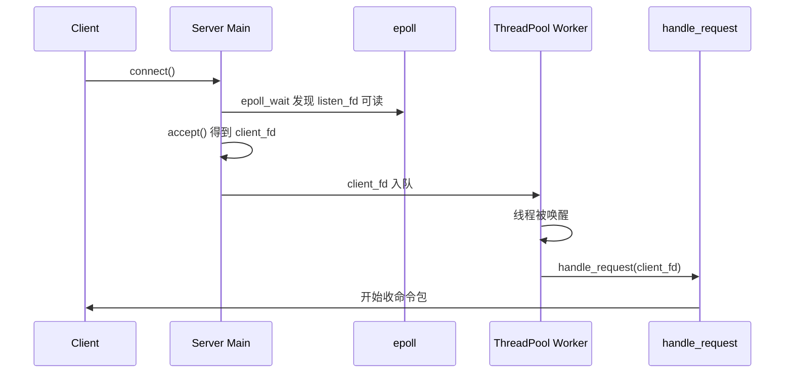
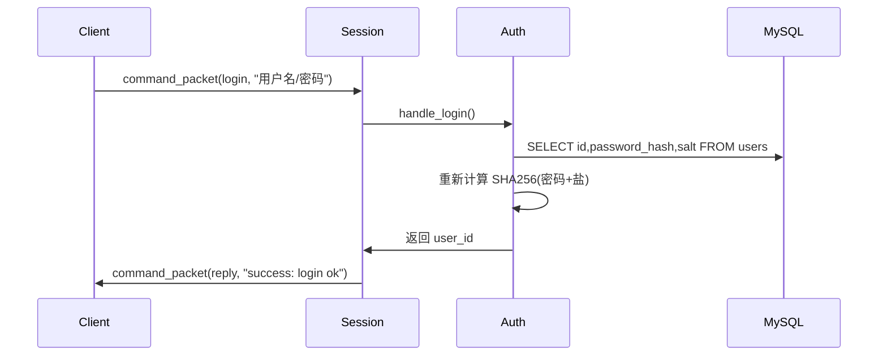
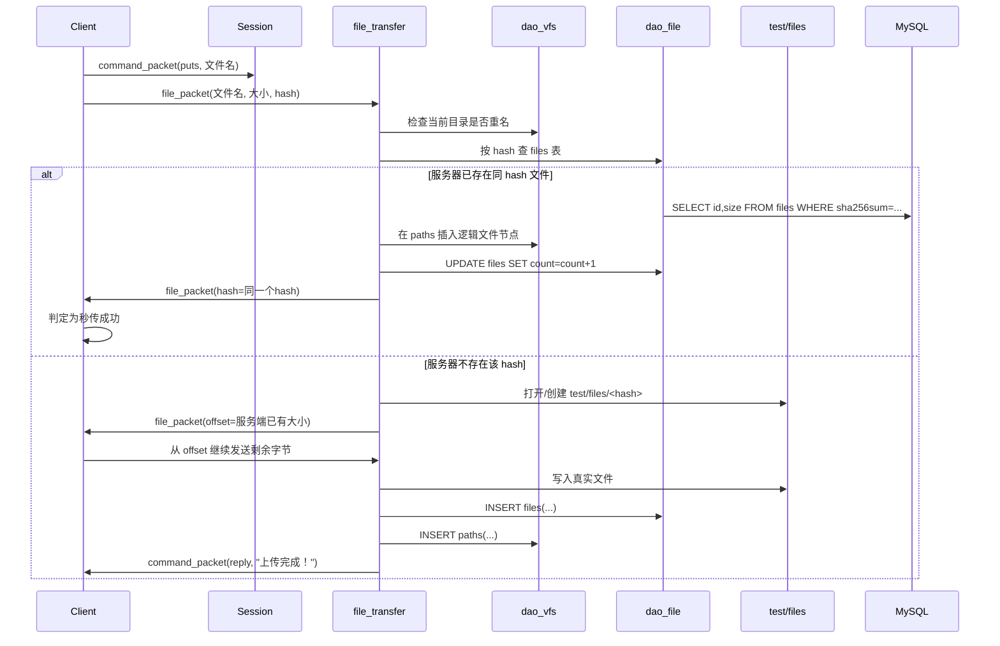
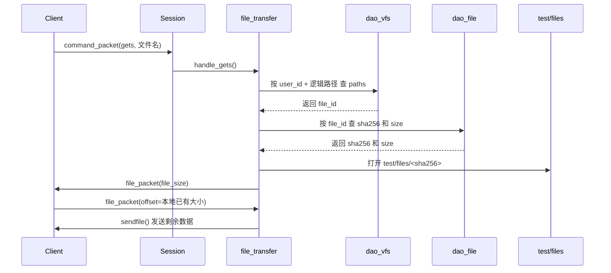

# WindCloud_V3 学习文档

## 1. 项目现在到底是什么

`WindCloud_V3` 是一个 C 语言学习型网盘项目。

它不是一个“只有文件传输”的小程序，而是把下面这些能力组合到了一起：

1. 客户端和服务端通过 TCP 通信
2. 服务端主进程使用 `epoll` 监听新连接
3. 服务端用线程池把每个客户端连接交给工作线程处理
4. 命令协议已经统一成固定结构体
5. 已经支持基本文件命令：`pwd`、`cd`、`ls`、`mkdir`、`rm`、`puts`、`gets`
6. 已经支持登录 / 注册
7. 已经引入 MySQL，用数据库保存用户、逻辑目录结构、真实文件信息
8. 已经支持断点续传
9. 已经支持基于 SHA-256 的秒传

可以把这个项目理解成三层：

- 网络层：负责“连上、收发、不断线”
- 业务层：负责“命令该怎么解释、该做什么”
- 存储层：负责“数据存在数据库哪里、文件存在磁盘哪里”

---

## 2. 先看总体架构

### 2.1 模块分层图

```text
客户端
├── client.c                     启动、登录菜单、命令循环
├── client_socket.c              connect 到服务端
└── client_command_handle.c      处理 puts/gets/普通命令

公共层
├── protocol.c / protocol.h      通信协议结构体、完整收发函数
├── log.c / log.h                日志系统
├── config.c / config.h          配置文件读取
└── sha256_utils.c / .h          文件 SHA-256 计算

服务端接入层
├── server.c                     主进程、epoll、线程池、数据库初始化
├── server_socket.c              listen/bind
├── epoll.c                      epoll 添加/删除监听
├── thread_pool.c                工作线程池
├── worker.c                     工作线程入口
└── session.c                    单个客户端连接上的命令总调度

服务端业务层
├── auth.c                       登录 / 注册
├── file_cmds.c                  pwd / cd / ls / mkdir / rm
└── file_transfer.c              puts / gets / 秒传 / 真实落盘

服务端数据库层
├── db_init.c                    自动建库建表
├── db_pool.c                    MySQL 连接池
├── dao_vfs.c                    paths 表操作
└── dao_file.c                   files 表操作
```

### 2.2 三张核心表

系统真正依赖的是这三张表：

#### `users`

保存用户账号信息：

- `id`
- `username`
- `password_hash`
- `salt`

#### `files`

保存真实文件信息：

- `id`
- `sha256sum`
- `size`
- `count`

这里的重点是：

- 一份真实文件只存一条
- `count` 表示有多少逻辑文件正在引用它

#### `paths`

保存用户看到的逻辑目录树：

- `id`
- `user_id`
- `path`
- `file_id`
- `parent_id`
- `file_name`
- `type`

其中：

- `type = 1` 表示目录
- `type = 0` 表示普通文件
- 普通文件通过 `file_id` 指向 `files` 表

---

## 3. 总体时序图

## 3.1 客户端连接到服务端



## 3.2 登录时序



## 3.3 上传与秒传时序



## 3.4 下载时序



---

## 4. 整个项目的工作主线

如果把整个项目当成一个故事来看，它的主线是下面这条：

1. 服务端启动
2. 读取配置文件
3. 初始化日志
4. 初始化数据库和三张表
5. 初始化数据库连接池
6. 创建监听 socket
7. 创建线程池
8. `epoll_wait` 等待新连接
9. 客户端连接后，把 `client_fd` 丢给线程池
10. 工作线程进入 `handle_request`
11. `handle_request` 持续接收客户端命令
12. 根据命令类型分发到具体模块
13. 普通命令走 `file_cmds.c`
14. 登录注册走 `auth.c`
15. 上传下载走 `file_transfer.c`

这也是学习项目时最推荐的阅读顺序：

1. `client.c`
2. `protocol.h`
3. `server.c`
4. `worker.c`
5. `session.c`
6. `file_cmds.c`
7. `file_transfer.c`
8. `dao_vfs.c` / `dao_file.c`
9. `db_pool.c`

---

## 5. 服务端启动全过程

服务端入口在 [src/server/server.c](/home/liwenshuo/my_project/WindCloud_V3/src/server/server.c)。

这个文件最重要，因为它控制全局。

### 5.1 服务端启动时做了什么

#### 第一步：读取配置

通过 `get_target()` 读取：

- `ip`
- `port`
- `log`
- `server_log`
- 数据库相关配置

这些配置最终来自 `config/config.ini`。

#### 第二步：初始化数据库

调用 `init_database()`。

这个函数会：

1. 连 MySQL
2. 如果数据库不存在就创建
3. 自动检查并创建 `users / files / paths`

所以服务端第一次启动时，不需要你先手动建表。

#### 第三步：初始化数据库连接池

调用 `init_db_pool()` 预先创建多个数据库连接。

为什么要这样做？

因为每个工作线程如果临时再去 `mysql_real_connect()`，开销大，而且代码会更乱。

所以这里的思路是：

- 启动时先准备好多个连接
- 业务线程需要查库时直接拿
- 用完再还回池子

#### 第四步：创建监听 socket

调用 `server_socket.c` 中的 `init_socket()`：

1. `socket()`
2. `setsockopt(SO_REUSEADDR)`
3. `bind()`
4. `listen()`

#### 第五步：创建线程池

调用 `init_thread_pool()`。

线程池不是“接到一个连接就创建一个新线程”，而是：

- 先固定创建若干工作线程
- 新连接来时，只把 `client_fd` 放进任务队列
- 空闲线程从队列里取任务执行

这比临时创建线程更稳定。

#### 第六步：进入 epoll 主循环

`server.c` 里用 `epoll_wait()` 同时监听：

- `listen_fd`：说明有新客户端到来
- `pipe_fd[0]`：说明父进程通知子进程退出

这就是服务端主控循环。

---

## 6. 线程池是怎么工作的

线程池核心在 [src/server/thread_pool.c](/home/liwenshuo/my_project/WindCloud_V3/src/server/thread_pool.c) 和 [src/server/worker.c](/home/liwenshuo/my_project/WindCloud_V3/src/server/worker.c)。

### 6.1 为什么需要线程池

客户端一旦连上，不是只发一条命令，而是可能持续发很多条命令。

所以最自然的处理方式是：

- 一个客户端连接
- 交给一个工作线程
- 工作线程在 `handle_request()` 里持续服务这个客户端

### 6.2 队列的作用

任务队列由 `queue.c` 实现。

里面放的不是复杂结构，而是最简单的 `client_fd`。

主线程负责：

- `accept()`
- `enQueue(client_fd)`
- `pthread_cond_signal()`

工作线程负责：

- `deQueue()`
- `handle_request(client_fd)`

### 6.3 工作线程的主循环

`thread_func()` 做的事情非常清楚：

1. 加锁
2. 如果队列为空就睡眠
3. 被唤醒后取出一个 `client_fd`
4. 记录自己正在处理哪个 fd
5. 调用 `handle_request()`
6. 客户端断开后清理 fd
7. 回到循环继续等下一份任务

这就是典型的“生产者-消费者模型”：

- 主线程是生产者
- 工作线程是消费者

---

## 7. 单个客户端连接上发生了什么

这一层在 [src/server/session.c](/home/liwenshuo/my_project/WindCloud_V3/src/server/session.c)。

可以把 `handle_request()` 理解为：

“这个客户端连接的总控制台”

### 7.1 `ClientContext` 是什么

`ClientContext` 定义在 [include/protocol.h](/home/liwenshuo/my_project/WindCloud_V3/include/protocol.h)：

- `user_id`
- `current_path`
- `parent_id`

它保存的是这个连接当前的会话状态。

这非常重要，因为服务端不是每条命令都重新问一遍：

- 你是谁？
- 你当前在哪个目录？

而是把这些状态放在 `ctx` 里一直保留。

### 7.2 为什么未登录时不能执行别的命令

`handle_request()` 中有一段关键判断：

- 如果 `ctx.user_id == -1`
- 且命令不是 `LOGIN / REGISTER`
- 就直接返回“请先登录”

这样整个系统就被“登录态”保护起来了。

### 7.3 命令分发

一旦收到了命令包，就根据 `cmd_type` 进入不同分支：

- `CMD_TYPE_LOGIN` -> `handle_login()`
- `CMD_TYPE_REGISTER` -> `handle_register()`
- `CMD_TYPE_PWD` -> `handle_pwd()`
- `CMD_TYPE_CD` -> `handle_cd()`
- `CMD_TYPE_LS` -> `handle_ls()`
- `CMD_TYPE_GETS` -> `handle_gets()`
- `CMD_TYPE_PUTS` -> `handle_puts()`

这就是整个业务调度中心。

---

## 8. 协议层到底解决了什么问题

协议层在 [include/protocol.h](/home/liwenshuo/my_project/WindCloud_V3/include/protocol.h) 和 [src/common/protocol.c](/home/liwenshuo/my_project/WindCloud_V3/src/common/protocol.c)。

### 8.1 为什么不用直接发字符串

如果只发字符串，例如直接发：

```text
puts a.txt
```

会遇到很多问题：

1. 服务端要自己切割字符串
2. 上传时文件大小、offset、hash 都没地方放
3. 一次 `recv()` 可能收不完整

所以这里定义了两个固定结构体：

#### `command_packet_t`

适合普通命令：

- 命令类型
- 字符串参数

#### `file_packet_t`

适合文件传输：

- 命令类型
- 文件大小
- 断点位置
- 文件名
- hash

### 8.2 `send_full()` / `recv_full()` 为什么重要

`send()` 和 `recv()` 一次并不保证把你想要的字节全部发完/收完。

所以这里封装了：

- `send_full()`
- `recv_full()`

它们的目标是：

“我要求发 280 字节，那就循环发到 280 字节为止”

这样协议就不会因为“半包问题”乱掉。

---

## 9. 客户端是怎么工作的

客户端入口在 [src/client/client.c](/home/liwenshuo/my_project/WindCloud_V3/src/client/client.c)。

### 9.1 客户端启动流程

1. 读取配置
2. 初始化日志
3. `connect()` 到服务端
4. 进入登录菜单
5. 登录成功后进入命令循环

### 9.2 登录菜单

现在客户端启动后不能直接操作文件，而是先输入：

- `login 用户名/密码`
- `register 用户名/密码`

这一点和第二期之前已经不一样了。

### 9.3 命令处理中心

命令具体处理都在 [src/client/client_command_handle.c](/home/liwenshuo/my_project/WindCloud_V3/src/client/client_command_handle.c)。

这个文件负责三种事：

1. 普通命令的发送和文本响应接收
2. `gets` 下载
3. `puts` 上传

---

## 10. 登录 / 注册功能详解

核心在 [src/server/auth.c](/home/liwenshuo/my_project/WindCloud_V3/src/server/auth.c)。

### 10.1 注册逻辑

客户端把：

```text
register 用户名/密码
```

发给服务端后，服务端会：

1. 拆出用户名和密码
2. 生成随机盐 `salt`
3. 计算 `SHA256(密码 + salt)`
4. 往 `users` 表插入：
   - `username`
   - `password_hash`
   - `salt`

### 10.2 登录逻辑

客户端把：

```text
login 用户名/密码
```

发给服务端后，服务端会：

1. 根据用户名查出 `password_hash` 和 `salt`
2. 用“用户输入的密码 + 数据库中的盐”重新算一次 hash
3. 和数据库存的 hash 比较
4. 一致则登录成功，并把 `user_id` 写入 `ClientContext`

### 10.3 为什么要加盐

如果两个用户密码一样，而数据库直接存普通 SHA-256：

- 两个人的 hash 就会一样

这样不安全。

加盐后：

- 就算两个用户密码一样
- 由于盐不同
- 存储的 hash 也会不同

---

## 11. 虚拟文件系统是怎么实现的

核心在 [src/server/file_cmds.c](/home/liwenshuo/my_project/WindCloud_V3/src/server/file_cmds.c) 和 [src/server/dao_vfs.c](/home/liwenshuo/my_project/WindCloud_V3/src/server/dao_vfs.c)。

### 11.1 为什么叫“虚拟文件系统”

用户看到的是：

```text
/work/report.txt
```

但这不是 Linux 上真实存在的目录结构。

它只是数据库 `paths` 表里的一条逻辑记录。

所以：

- 用户看到的是“虚拟路径”
- 服务器真正保存的是“数据库关系 + 真实文件目录”

### 11.2 `pwd`

最简单，直接把 `ctx.current_path` 返回给客户端。

### 11.3 `cd`

`cd` 并不是调用 `chdir()` 改 Linux 进程目录，而是：

1. 拼出目标逻辑路径
2. 去 `paths` 表里查这条路径是否存在
3. 确认它是不是目录
4. 成功后更新：
   - `ctx.current_path`
   - `ctx.parent_id`

### 11.4 `ls`

根据：

- `user_id`
- `parent_id`

去 `paths` 表查当前目录下的所有子节点。

所以 `ls` 的本质不是读硬盘目录，而是查数据库。

### 11.5 `mkdir`

本质是往 `paths` 表插一条目录类型记录：

- `type = 1`

---

## 12. 文件传输核心详解

文件传输核心在 [src/server/file_transfer.c](/home/liwenshuo/my_project/WindCloud_V3/src/server/file_transfer.c)。

这是当前系统最关键的文件之一。

## 12.1 上传 `puts`

上传流程可以分成下面几步。

### 第一步：先收命令，再收文件包

客户端会先发：

1. `command_packet_t`
2. `file_packet_t`

所以服务端必须先后对应地接收。

### 第二步：生成逻辑路径

例如：

- 当前目录是 `/`
- 上传 `a.txt`

逻辑路径就是：

```text
/a.txt
```

### 第三步：检查重名

如果当前用户当前目录下已经有同名逻辑路径，就直接拒绝。

这里已经做了一个很重要的协议修复：

- 服务端不是只发文本包
- 而是先补一个 `file_packet_t`
- 再发文本错误信息

这样客户端不会卡在等文件包。

### 第四步：按 hash 查 `files` 表

这一步就是秒传判断：

- 如果 hash 已存在 -> 秒传
- 如果 hash 不存在 -> 正常上传

### 第五步：秒传

秒传时并不接收文件内容，而是直接：

1. 在 `paths` 表中插逻辑文件节点
2. `files.count + 1`
3. 回客户端一个带相同 hash 的 `file_packet_t`

客户端看到：

```c
strcmp(server_file_packet.hash, file_hash) == 0
```

就会打印“极速秒传成功”。

### 第六步：正常上传

如果服务器还没有这个 hash，就走真正的上传过程：

1. 真实文件路径拼成 `test/files/<sha256>`
2. 看这个真实文件当前已存在多少字节
3. 把 offset 发回客户端
4. 客户端从这个 offset 继续发
5. 服务端用 `mmap + recv` 写入剩余数据
6. 完整收满后，再写数据库

### 第七步：为什么真实文件名是 hash

因为这样才能保证：

1. 同内容文件天然共用一份
2. 下载时能稳定定位
3. 逻辑目录和物理目录彻底解耦

---

## 12.2 下载 `gets`

下载比上传更能体现数据库设计思想。

### 下载的完整链路

用户输入：

```text
gets a.txt
```

服务端会做下面这条查询链：

1. 当前目录 + 文件名 -> 得到逻辑路径
2. 去 `paths` 表查该逻辑路径 -> 得到 `file_id`
3. 去 `files` 表查 `file_id` -> 得到 `sha256sum`
4. 真实路径 = `test/files/<sha256sum>`
5. 打开真实文件并发送

也就是说，下载不是直接靠文件名找磁盘文件，而是靠：

```text
文件名 -> 逻辑路径 -> file_id -> sha256 -> 真实文件
```

这就是数据库化改造的核心思想。

### 断点续传

下载时客户端会先检查本地是否已有同名文件。

如果已有：

- 本地文件比服务端小 -> 继续续传
- 一样大 -> 认为已经完整，不必下载
- 更大 -> 从 0 重新下

服务端收到客户端给出的 `offset` 后，再从该位置继续 `sendfile()`。

---

## 13. 数据库访问层怎么理解

### 13.1 `db_pool.c`

这是最底层的数据库“公路”。

它不关心业务语义，只做两件事：

1. 从连接池里拿连接
2. 执行 SQL

对上层暴露的接口很简单：

- `db_execute_update()`
- `db_execute_query()`

### 13.2 `dao_vfs.c`

这是“目录树 DAO”。

专门处理 `paths` 表。

例如：

- `dao_get_node_by_path()`
- `dao_list_dir()`
- `dao_create_node()`
- `dao_create_file_node()`

### 13.3 `dao_file.c`

这是“真实文件 DAO”。

专门处理 `files` 表。

例如：

- `dao_file_find_by_sha256()`
- `dao_file_insert()`
- `dao_file_add_ref_count()`
- `dao_file_get_info_by_id()`

所以数据库层有一个很清楚的分工：

- `db_pool`：只做通用数据库访问
- `dao_vfs`：只做逻辑路径业务
- `dao_file`：只做真实文件业务

---

## 14. 日志系统怎么帮助我们学习项目

日志系统在 [src/common/log.c](/home/liwenshuo/my_project/WindCloud_V3/src/common/log.c)。

它的价值不只是“记录问题”，更重要的是：

- 帮你观察程序在运行时到底走到了哪里

日志格式大致是：

```text
[时间] [级别] [文件:行号 函数名] 消息
```

所以你在学习这个项目时，非常建议：

1. 打开 `log/server.log`
2. 执行一次 `login`
3. 执行一次 `puts`
4. 对照日志反推代码执行顺序

这比只盯着源码更容易理解运行流程。

---

## 15. 一次完整上传的全流程讲解

下面把一次真实上传从头到尾再完整讲一遍。

假设：

- 用户名：`zs`
- 当前路径：`/`
- 上传文件：`a.txt`

### 第 1 步：客户端读取命令

用户在客户端输入：

```text
puts a.txt
```

客户端会在 `client_command_handle.c` 中识别出这是 `CMD_TYPE_PUTS`。

### 第 2 步：客户端先算 hash

客户端调用 `get_file_sha256()` 计算本地文件 SHA-256。

### 第 3 步：客户端发命令包

客户端先发一个普通命令包，告诉服务端：

```text
我要执行 puts
```

### 第 4 步：客户端再发文件包

文件包里包含：

- 文件名
- 文件大小
- hash

### 第 5 步：服务端进入 `handle_puts()`

服务端从 `session.c` 分发到 `handle_puts()`。

### 第 6 步：服务端判断是否重名

先看当前用户当前目录下是否已经有 `/a.txt` 这条逻辑路径。

如果已经有，就拒绝。

### 第 7 步：服务端判断是否秒传

根据 hash 去查 `files` 表。

#### 如果有

直接：

- 插 `paths`
- 引用计数加 1
- 回“秒传成功”

#### 如果没有

进入真正上传流程。

### 第 8 步：断点续传协商

服务端看 `test/files/<hash>` 这个真实文件是否已经存在一部分。

如果存在一部分，就把已有偏移告诉客户端。

### 第 9 步：客户端继续发剩余内容

客户端把本地文件读指针移动到 offset，然后继续发后半段内容。

### 第 10 步：服务端写真实文件

服务端通过 `mmap` 把真实文件映射到内存，再不断 `recv()` 写进去。

### 第 11 步：补数据库记录

文件完整后：

1. 插入 `files`
2. 插入 `paths`

到这里，上传才算真正完成。

---

## 16. 一次完整下载的全流程讲解

再把一次下载完整讲一遍。

假设用户输入：

```text
gets a.txt
```

### 第 1 步：客户端发送下载命令

客户端发一个普通命令包：

- 类型是 `CMD_TYPE_GETS`
- 参数是文件名 `a.txt`

### 第 2 步：服务端拼逻辑路径

如果当前目录是 `/doc`，则逻辑路径就是：

```text
/doc/a.txt
```

### 第 3 步：服务端查 `paths`

根据：

- `user_id`
- `path`

查出这个逻辑文件记录，并拿到 `file_id`。

### 第 4 步：服务端查 `files`

再根据 `file_id` 查出：

- `sha256sum`
- `size`

### 第 5 步：服务端打开真实文件

真实文件路径为：

```text
test/files/<sha256>
```

### 第 6 步：服务端先回文件大小

客户端必须先知道服务端文件总大小，才能决定断点续传位置。

### 第 7 步：客户端回 offset

客户端检查本地已有文件大小，计算：

- 该从哪里继续下

然后把 `offset` 发给服务端。

### 第 8 步：服务端 sendfile

服务端从 offset 开始，把剩余内容发给客户端。

### 第 9 步：客户端下载完成

客户端把收到的数据继续写入本地文件。

最终文件恢复完整。

---

## 17. 这个项目里最值得学习的技术点

## 17.1 固定协议结构体

这是网络程序非常常见的做法。

优点：

1. 双方协议明确
2. 收发逻辑简单
3. 命令和文件传输都能统一

## 17.2 `epoll + 线程池`

这是一个很典型的服务端架构组合：

- `epoll` 负责高效监听
- 线程池负责并发处理

虽然这个项目规模还不大，但这个思路非常有学习价值。

## 17.3 数据库模拟文件树

这是第三期最核心的思想。

以前目录树靠真实目录管理。

现在目录树靠：

```text
paths 表 + parent_id
```

管理。

这说明：

- “文件系统结构”本质上也是一种关系数据

## 17.4 hash 去重与秒传

这是网盘项目很经典的能力：

- 同内容文件只保存一份
- 新用户上传同内容文件时不再重复传输

本项目用 SHA-256 把这件事讲得非常直观。

## 17.5 断点续传

这个项目没有停留在“从头传到尾”，而是已经实现：

- 上传断点续传
- 下载断点续传

这对于学习实际文件传输非常有帮助。

---

## 18. 当前实现中的简化点

这个项目是学习型项目，所以有些地方是刻意简化过的。

这些简化不是“错”，而是教学上的取舍。

### 18.1 SQL 拼接比较直接

现在大量使用 `snprintf()` 拼 SQL。

好处是直观。

代价是：

- 真实项目中应该进一步考虑 SQL 注入和转义问题

### 18.2 事务没有做得很重

比如：

- 插 `paths`
- 改 `files.count`

当前没有用严格事务包起来。

真实项目会更严谨，但对初学者来说，这种写法更容易理解。

### 18.3 上传中的半截文件没有单独建“上传中表”

当前做法是：

- 真实磁盘上允许先有一个半截 hash 文件
- 下次继续续传

这已经够用，而且实现简单。

### 18.4 目前 `puts/gets` 按当前目录下单层文件名处理

这样做是为了让成员 E 的传输代码保持直观。

如果将来要支持更复杂的多级相对路径，可以继续扩展。

---

## 19. 初学者应该怎么学这个项目

如果你是第一次接触这种项目，建议按下面顺序学。

### 第一轮：只看主流程

只看：

- `client.c`
- `server.c`
- `worker.c`
- `session.c`

目标：

- 明白程序怎么跑起来
- 明白一个连接怎么被线程处理

### 第二轮：看协议

重点看：

- `protocol.h`
- `protocol.c`

目标：

- 明白客户端和服务端到底在传什么

### 第三轮：看普通命令

重点看：

- `file_cmds.c`
- `dao_vfs.c`

目标：

- 明白虚拟路径如何映射到数据库

### 第四轮：看登录

重点看：

- `auth.c`

目标：

- 明白登录态、加盐 hash、用户上下文

### 第五轮：看上传下载

重点看：

- `client_command_handle.c`
- `file_transfer.c`
- `dao_file.c`

目标：

- 明白断点续传和秒传

### 第六轮：结合日志实际跑一遍

建议你真的：

1. 启动服务端
2. 启动客户端
3. 登录
4. 上传
5. 秒传
6. 下载

再对照日志回看代码。

这是掌握这个项目最快的方法。

---

## 20. 最后的总总结

这个项目最核心的思想，其实可以浓缩成下面几句话：

1. 客户端和服务端通过固定结构体协议通信
2. 服务端用 `epoll + 线程池` 同时服务多个客户端
3. 每个客户端连接都维护自己的 `ClientContext`
4. 用户看到的目录结构放在 `paths` 表中
5. 真实文件信息放在 `files` 表中
6. 真实磁盘文件统一按 hash 保存在 `test/files/`
7. 上传时先查 hash，能秒传就不再传文件
8. 下载时先查逻辑路径，再查真实文件 hash，最后定位磁盘文件

只要你真正理解了这 8 句话，就已经抓住了 `WindCloud_V3` 当前版本的主干。

接下来再回头看每个 `.c` 文件，就不会再觉得它们是零散的，而会知道：

- 每个模块在系统里处于什么位置
- 它为什么存在
- 它和上下游模块是怎么配合的

这就是学习这种工程项目时，最关键的一步。
