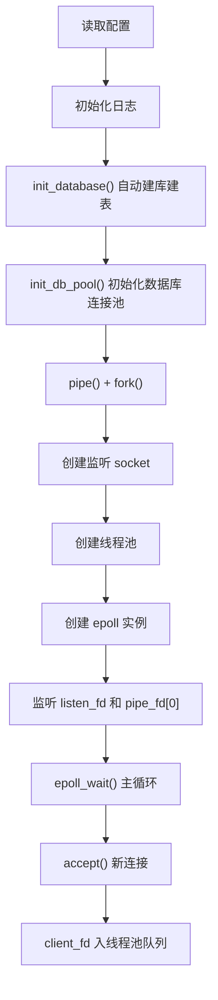
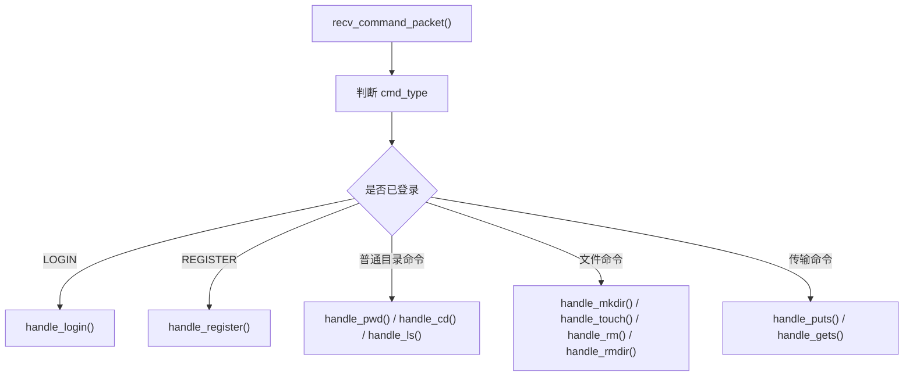
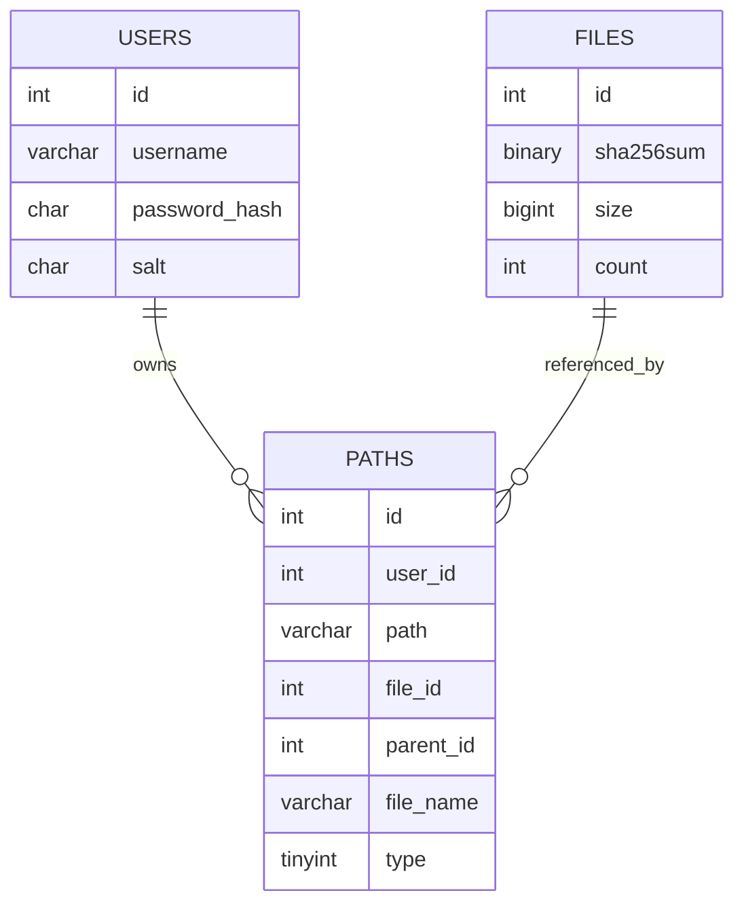
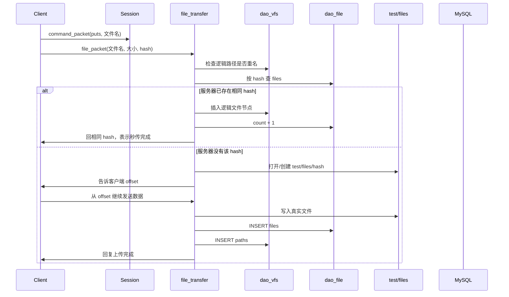
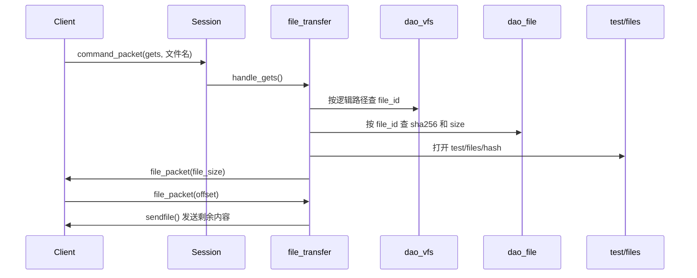

# WindCloud_V3 学习文档

## 1. 这是什么项目

`WindCloud_V3` 是一个用 C 语言实现的学习型网盘项目。

它已经不再是“只能上传下载文件”的小练习，而是把下面这些能力组合到了一起：

1. 客户端和服务端通过 TCP 通信
2. 客户端和服务端使用统一的固定结构体协议
3. 服务端使用 `epoll + 线程池` 处理多个连接
4. 服务端引入 MySQL，保存用户、虚拟目录树、真实文件信息
5. 已支持登录 / 注册
6. 已支持目录命令：`pwd`、`cd`、`ls`、`mkdir`
7. 已支持文件命令：`touch`、`rm`、`rmdir`
8. 已支持上传 `puts`、下载 `gets`
9. 已支持上传断点续传、下载断点续传
10. 已支持基于 SHA-256 的秒传与文件去重

如果只用一句话概括这个项目，可以这样理解：

> 它是一个“协议驱动的虚拟文件系统 + 去重文件存储系统”。

---

## 2. 先抓住项目的主干

学习这个项目时，最重要的不是一开始把每个 `.c` 文件都细扣，而是先抓住下面这 8 句话：

1. 客户端和服务端通过固定结构体协议通信
2. 服务端主进程负责接入连接，不直接处理具体业务
3. 新连接会被丢进线程池，由工作线程长期服务这个连接
4. 每个连接在服务端都有一份 `ClientContext`
5. 用户看到的目录树保存在 `paths` 表
6. 真实文件实体保存在 `files` 表和 `test/files/<sha256>`
7. 上传时先按 hash 查 `files`，有则秒传，没有则真正传输
8. 下载时先查逻辑路径，再查真实文件 hash，最后定位磁盘文件

只要你真正理解了这 8 句话，再回头看源码，整个工程就不会显得零散。

---

## 3. 当前代码结构

### 3.1 客户端

```text
src/client/
├── client.c
├── client_command_handle.c
├── client_gets.c
├── client_puts.c
└── client_socket.c
```

职责分工：

- `client.c`
  - 客户端入口
  - 读取配置
  - 初始化日志
  - 连接服务端
  - 登录菜单
  - 命令循环
- `client_command_handle.c`
  - 解析用户输入
  - 校验命令参数
  - 将命令分发到普通命令 / 上传 / 下载处理逻辑
- `client_gets.c`
  - 处理下载
  - 处理下载断点续传
- `client_puts.c`
  - 处理上传
  - 处理秒传
  - 处理上传断点续传
- `client_socket.c`
  - 创建 socket
  - 连接服务端

### 3.2 服务端

```text
src/server/
├── server.c
├── server_socket.c
├── epoll.c
├── thread_pool.c
├── worker.c
├── queue.c
├── session.c
├── auth.c
├── file_cmds.c
├── file_transfer.c
├── dao_user.c
├── dao_vfs.c
├── dao_file.c
├── db_pool.c
├── db_init.c
└── path_utils.c
```

职责分工：

- `server.c`
  - 服务端入口
  - 读取配置
  - 初始化日志
  - 初始化数据库和连接池
  - 创建监听 socket
  - 创建线程池
  - `epoll_wait()` 接收新连接和退出信号
- `thread_pool.c` / `worker.c` / `queue.c`
  - 线程池和任务队列
- `session.c`
  - 单个客户端连接上的命令总调度
- `auth.c`
  - 登录 / 注册
- `file_cmds.c`
  - 目录和文件系统命令
- `file_transfer.c`
  - 上传 / 下载 / 秒传 / 断点续传
- `dao_user.c`
  - `users` 表访问
- `dao_vfs.c`
  - `paths` 表访问
- `dao_file.c`
  - `files` 表访问
- `db_pool.c`
  - MySQL 连接池
- `db_init.c`
  - 自动建库建表

### 3.3 公共层

```text
src/common/
├── protocol.c
├── config.c
├── log.c
└── sha256_utils.c
```

职责分工：

- `protocol.c`
  - 固定协议结构体的收发封装
- `config.c`
  - 配置读取
- `log.c`
  - 日志系统
- `sha256_utils.c`
  - 计算文件 SHA-256

---

## 4. 推荐阅读顺序

如果你第一次读这个项目，建议按下面顺序看：

1. `src/client/client.c`
2. `include/protocol.h`
3. `src/server/server.c`
4. `src/server/worker.c`
5. `src/server/session.c`
6. `src/server/auth.c`
7. `src/server/file_cmds.c`
8. `src/server/file_transfer.c`
9. `src/server/dao_vfs.c`
10. `src/server/dao_file.c`
11. `src/server/db_pool.c`

原因很简单：

- 先看客户端入口，知道用户怎么发命令
- 再看协议，知道双方到底传什么
- 再看服务端入口，知道服务端怎么收连接
- 再看会话层，知道一条命令怎样被分发
- 最后再看业务和 DAO，细扣具体逻辑

---

## 5. 从启动开始理解整个系统

## 5.1 服务端启动流程

服务端入口在 [src/server/server.c](/home/liwenshuo/my_project/WindCloud_V3/src/server/server.c)。

启动流程可以概括为：



这里有 3 个特别值得注意的点。

### 第一，服务端不是一个线程包打天下

当前模型是：

- 主线程负责接入连接
- 工作线程负责处理连接上的业务

也就是说，`epoll` 只负责“发现有新连接”，不是负责所有业务 IO。

### 第二，服务端用了 `pipe + fork`

这意味着：

- 父进程负责接收 `Ctrl+C`
- 子进程负责真正跑服务器
- 父进程通过管道通知子进程退出

所以当前退出流程也是架构的一部分，不是简单 `while(1)`。

### 第三，数据库会自动建库建表

`db_init.c` 会自动检查并创建：

- `users`
- `files`
- `paths`

所以第一次跑服务端时，不需要手工先建表。

---

## 5.2 线程池在这里扮演什么角色

线程池相关代码在：

- [src/server/thread_pool.c](/home/liwenshuo/my_project/WindCloud_V3/src/server/thread_pool.c)
- [src/server/worker.c](/home/liwenshuo/my_project/WindCloud_V3/src/server/worker.c)
- [src/server/queue.c](/home/liwenshuo/my_project/WindCloud_V3/src/server/queue.c)

这个线程池不是“每条命令一个任务”，而是：

1. 主线程 `accept()` 得到 `client_fd`
2. 把 `client_fd` 放到任务队列
3. 某个工作线程被唤醒
4. 工作线程调用 `handle_request(client_fd)`
5. 这个线程会持续服务这个连接，直到连接断开

所以它更准确地说是：

> 一个连接级线程池，而不是短任务级线程池

这也是为什么 `session.c` 这么重要。

---

## 6. 会话层是整个项目的枢纽

会话层在 [src/server/session.c](/home/liwenshuo/my_project/WindCloud_V3/src/server/session.c)。

可以把它理解成：

> 单个客户端连接上的总控制台

### 6.1 `ClientContext` 是什么

当前 `ClientContext` 定义在 [include/protocol.h](/home/liwenshuo/my_project/WindCloud_V3/include/protocol.h)：

```c
typedef struct{
    int user_id;
    char current_path[256];
    int current_dir_id;
} ClientContext;
```

它保存单个客户端连接的会话状态：

- `user_id`
  - 当前连接登录后的用户 ID
- `current_path`
  - 当前逻辑路径字符串，例如 `/doc/work`
- `current_dir_id`
  - 当前目录自己的节点 ID
  - 根目录约定为 `0`

### 6.2 为什么 `current_dir_id` 很重要

这是当前版本里非常关键的一点。

以前这个字段叫 `parent_id`，容易误导人，以为它表示“父目录 ID”。

但在当前代码里，它的真实语义一直都是：

> 当前所在目录的节点 ID

改成 `current_dir_id` 以后，语义就清楚多了。

例如：

- `ls`
  - 需要用它去查“当前目录的所有孩子节点”
- `mkdir`
  - 需要把它作为新目录节点的 `parent_id`
- `touch`
  - 需要把它作为新文件节点的 `parent_id`
- `puts`
  - 需要把它作为新逻辑文件节点的 `parent_id`

### 6.3 会话层怎么分发命令

`handle_request()` 中会：

1. 循环接收 `command_packet_t`
2. 检查当前是否登录
3. 根据 `cmd_type` 分发到不同业务函数

大致关系如下：



---

## 7. 协议层到底解决了什么问题

协议层在：

- [include/protocol.h](/home/liwenshuo/my_project/WindCloud_V3/include/protocol.h)
- [src/common/protocol.c](/home/liwenshuo/my_project/WindCloud_V3/src/common/protocol.c)

## 7.1 当前项目用了两种协议包

### `command_packet_t`

适合普通命令和普通文本响应。

包含：

- 命令类型
- 有效数据长度
- 参数字符串 / 文本响应

适用场景：

- `pwd`
- `cd`
- `ls`
- `mkdir`
- `touch`
- `rm`
- `rmdir`
- `login`
- `register`
- 普通文本回复

### `file_packet_t`

适合文件传输协商。

包含：

- 命令类型
- 文件大小
- 断点位置 `offset`
- 文件名
- 哈希值 `hash`

适用场景：

- 上传时告诉服务端文件大小和 hash
- 下载时服务端告诉客户端文件大小
- 断点续传时协商 offset
- 秒传时回传相同 hash 作为完成标志

## 7.2 为什么要封装 `send_full()` / `recv_full()`

因为一次 `send()` / `recv()` 不保证完整发完 / 收完你想要的字节数。

所以协议层封装了：

- `send_full()`
- `recv_full()`
- `send_command_packet()`
- `recv_command_packet()`
- `send_file_packet()`
- `recv_file_packet()`

这样调用方就可以按固定结构体长度进行完整收发，避免“半包问题”把协议搞乱。

---

## 8. 数据库为什么要设计成三张表

当前数据库是 `netdisk_db`，核心三张表是：

- `users`
- `files`
- `paths`

## 8.1 `users` 表

作用：存账号信息。

关键字段：

- `id`
- `username`
- `password_hash`
- `salt`

## 8.2 `files` 表

作用：存真实文件实体。

关键字段：

- `id`
- `sha256sum`
- `size`
- `count`

这里的重点是：

- 一份真实内容只存一条
- `count` 表示有多少个逻辑文件节点正在引用它

## 8.3 `paths` 表

作用：存用户看到的虚拟目录树。

关键字段：

- `id`
- `user_id`
- `path`
- `file_id`
- `parent_id`
- `file_name`
- `type`

其中：

- `type = 1`
  - 目录
  - `file_id = NULL`
- `type = 0`
  - 普通文件
  - `file_id` 指向 `files.id`

## 8.4 这三张表如何配合



这张关系图最核心的一点是：

- `paths` 表决定“用户看到什么目录和文件”
- `files` 表决定“真实文件是谁”

所以目录树和真实文件是分离的。

---

## 9. 登录 / 注册功能怎么工作的

认证逻辑在 [src/server/auth.c](/home/liwenshuo/my_project/WindCloud_V3/src/server/auth.c)。

## 9.1 注册

客户端输入：

```text
register 用户名/密码
```

服务端会：

1. 拆出用户名和密码
2. 生成随机盐 `salt`
3. 计算 `SHA256(密码 + salt)`
4. 调用 `dao_insert_user()` 写入数据库
5. 给客户端返回“注册成功，请继续登录”

## 9.2 登录

客户端输入：

```text
login 用户名/密码
```

服务端会：

1. 根据用户名查出数据库中的 `password_hash` 和 `salt`
2. 用用户输入密码重新计算加盐哈希
3. 比较是否一致
4. 一致则登录成功，并把 `user_id` 写入 `ClientContext`

## 9.3 为什么要加盐

如果只存普通 SHA-256，那么两个密码一样的用户，数据库里哈希也会一样。

加盐后：

- 即使两个用户密码相同
- 因为盐不同
- 存储的哈希也不同

这样更安全。

---

## 10. 虚拟文件系统是怎么工作的

目录命令集中在 [src/server/file_cmds.c](/home/liwenshuo/my_project/WindCloud_V3/src/server/file_cmds.c)。

关键思想只有一句：

> 当前项目操作的是虚拟路径，不是 Linux 进程当前目录。

## 10.1 `pwd`

最简单，直接返回：

- `ctx.current_path`

## 10.2 `cd`

`cd` 不会调用 `chdir()`，而是：

1. 根据 `current_path + 参数` 拼出目标逻辑路径
2. 到 `paths` 表中查目标路径是否存在
3. 检查目标是不是目录
4. 更新：
   - `ctx.current_path`
   - `ctx.current_dir_id`

## 10.3 `ls`

`ls` 的本质不是“读磁盘目录”，而是：

```text
SELECT file_name, type
FROM paths
WHERE user_id = 当前用户
  AND parent_id = current_dir_id
```

也就是说，`ls` 是查“当前目录的孩子节点”。

## 10.4 `mkdir`

`mkdir` 会：

1. 检查目标逻辑路径是否已存在
2. 调用 `dao_create_node(..., type=1)`
3. 在 `paths` 中插入一个目录节点

目录不需要真实文件实体，所以不会写 `files` 表。

## 10.5 `touch`

这是本轮更新后非常值得注意的一点。

以前的问题是：

- `touch` 只往 `paths` 表插入一条普通文件节点
- 但没有对应的 `files` 记录
- `paths.file_id` 也是空的

这样后续 `gets` 会找不到真实文件实体。

现在的实现已经修复，`touch` 的行为是：

1. 检查目标逻辑路径是否已存在
2. 确保空文件对应的真实文件 `test/files/<空文件sha256>` 存在
3. 在 `files` 表中复用或创建空文件记录
4. 用 `dao_create_file_node()` 在 `paths` 中插入带 `file_id` 的普通文件节点
5. 如果复用了已有空文件记录，则让 `files.count + 1`

所以现在的 `touch` 已经和 `puts` / `gets` / 秒传体系对齐了。

## 10.6 `rm` 和 `rmdir`

### `rm`

会：

1. 查逻辑路径
2. 校验目标必须是文件
3. 删除 `paths` 节点

### `rmdir`

会：

1. 查逻辑路径
2. 校验目标必须是目录
3. 先检查目录是否为空
4. 再删除目录节点

当前删除逻辑主要处理的是：

- 删除虚拟文件系统里的节点

还没有把“`files.count - 1` 直到物理文件回收”这条链路完全补齐，这是后续可以继续完善的点。

---

## 11. 文件传输核心是怎么工作的

文件传输逻辑在 [src/server/file_transfer.c](/home/liwenshuo/my_project/WindCloud_V3/src/server/file_transfer.c)。

这个文件是整个项目里最关键的模块之一。

## 11.1 为什么真实文件按 hash 存

真实文件统一存放在：

```text
test/files/<sha256>
```

这样做有 3 个好处：

1. 同内容文件天然只需要保存一份
2. 秒传判断很简单，直接按 hash 查 `files`
3. 逻辑目录树和物理存储彻底解耦

## 11.2 上传 `puts` 的整体流程



## 11.3 上传过程中最值得学习的几个点

### 第一，客户端先发两次协议包

上传时客户端会先发：

1. `command_packet_t`
2. `file_packet_t`

所以服务端 `handle_puts()` 一进入就必须先收 `file_packet_t`，否则协议会错位。

### 第二，秒传不是“跳过保存逻辑节点”

秒传只是跳过“真正的文件内容传输”，并不跳过数据库逻辑。

秒传成功时仍然需要：

1. 在 `paths` 中插入逻辑文件节点
2. 把 `files.count + 1`

### 第三，断点续传依赖服务端已有的真实文件长度

服务端会看：

```text
test/files/<hash>
```

已经有多少字节，然后把 `offset` 发给客户端，客户端从这个位置继续发。

### 第四，空文件上传也是合法场景

当前实现里：

- 空文件不需要走数据传输循环
- 但仍然会补齐 `files` 和 `paths`

这和当前 `touch` 的设计是一致的。

## 11.4 下载 `gets` 的整体流程



## 11.5 下载链路最重要的理解

下载不是直接按文件名找磁盘文件，而是：

```text
文件名
-> 当前目录下的逻辑路径
-> paths.file_id
-> files.sha256sum
-> test/files/<sha256>
```

这正是“逻辑目录与物理文件分离”的体现。

---

## 12. 客户端当前是怎么工作的

客户端入口在 [src/client/client.c](/home/liwenshuo/my_project/WindCloud_V3/src/client/client.c)。

## 12.1 客户端启动流程

1. 读取配置
2. 初始化日志
3. `connect()` 到服务端
4. 进入登录 / 注册菜单
5. 登录成功后进入命令循环

## 12.2 客户端命令处理结构

现在客户端已经不像以前那样把所有逻辑都塞在一个文件里了。

当前结构是：

- `client_command_handle.c`
  - 输入解析
  - 参数校验
  - 命令分发
  - 普通命令响应接收
- `client_gets.c`
  - 下载与下载续传
- `client_puts.c`
  - 上传、秒传、上传续传

这次拆分很重要，因为它让客户端结构和服务端更对称，也更容易继续扩展。

## 12.3 客户端为什么不维护目录上下文

当前目录状态真正保存在服务端：

- `ctx.current_path`
- `ctx.current_dir_id`

客户端主要负责：

1. 读取用户输入
2. 按协议把命令发给服务端
3. 配合服务端完成上传 / 下载 / 续传握手
4. 打印结果

所以当前架构中：

> 客户端是命令发起者，服务端才是目录会话状态持有者

---

## 13. 数据访问层怎么理解

## 13.1 `db_pool.c`

它是最底层的数据库访问公路。

它并不关心你是在查用户、查路径，还是查真实文件。

它只负责两件事：

1. 从连接池拿连接
2. 执行 SQL

对上层提供的接口很简单：

- `db_execute_update()`
- `db_execute_query()`

## 13.2 `dao_user.c`

负责 `users` 表。

上层 `auth.c` 通过它来实现登录 / 注册相关查询和插入。

## 13.3 `dao_vfs.c`

负责 `paths` 表。

这里面最值得注意的点是：

- 根目录 `/` 并不会真的存成数据库记录
- 代码里约定根目录：
  - `id = 0`
  - `type = 1`

因此：

- 根目录下新建节点时，它们的 `parent_id = 0`
- 当前在根目录时，`ctx.current_dir_id = 0`

## 13.4 `dao_file.c`

负责 `files` 表。

主要解决的问题是：

- 某个 hash 是否已经存在
- 这个真实文件的 `id` 是多少
- 文件大小是多少
- 引用计数怎么加

---

## 14. 学习这个项目时最该盯住什么

如果你已经会写基本 socket 程序，那么这个项目里最有价值的学习点主要是下面这几项。

## 14.1 固定结构体协议

这是网络程序里很常见也很实用的做法。

优点：

1. 双方收发边界明确
2. 命令类型统一
3. 文件传输协商信息也能统一编码

## 14.2 `epoll + 线程池` 的组合

这里的架构不是最重型的高并发方案，但非常适合学习。

你能清楚看到：

- `epoll` 负责什么
- 线程池负责什么
- 连接从接入到会话处理是怎么切换的

## 14.3 数据库模拟目录树

这是第三期及之后最核心的思想之一。

目录树并不是只能靠 Linux 真实目录来表示。

在这个项目里，目录树靠的是：

```text
paths 表 + parent_id
```

这就是虚拟文件系统。

## 14.4 逻辑文件和真实文件分离

这一步一做出来，很多能力就自然成立了：

- 秒传
- 去重
- 多个逻辑文件共用一份实体文件
- 下载时稳定定位真实文件

## 14.5 断点续传

项目里不只是“能传”，而是已经支持：

- 上传断点续传
- 下载断点续传

这对理解真实文件传输系统很有价值。

---

## 15. 当前实现中的简化点

这是学习型项目，不是生产级网盘，所以有些地方是刻意简化的。

这些简化不是错误，而是为了更容易理解核心机制。

## 15.1 SQL 仍然主要靠字符串拼接

好处：

- 直观
- 容易看懂每条 SQL 干了什么

代价：

- 真实项目里应该进一步考虑参数化查询和更严谨的转义

## 15.2 多步数据库写操作没有全面事务化

例如：

- 补 `paths`
- 补 `files`
- 改 `count`

当前逻辑能工作，但如果继续追求严谨性，后面还可以继续加事务。

## 15.3 删除链路还没完全把 `files.count` 和物理回收闭环

当前更关注的是：

- 能正确创建逻辑节点
- 能正确上传下载
- 能正确秒传和续传

删除路径上的“引用计数递减到 0 后删除实体文件”还可以继续加强。

## 15.4 传输路径仍然限制为当前目录下单层文件名

当前 `puts/gets` 是按：

```text
当前目录 + 文件名
```

来处理的。

这让实现更直观，但如果未来要支持更复杂的多级相对路径，路径解析和 `current_dir_id` 的维护都要一起增强。

---

## 16. 如果你要亲手跑一遍，建议怎么观察

最推荐的学习方式不是只读代码，而是：

1. 启动服务端
2. 启动客户端
3. 注册一个用户
4. 登录
5. 执行一次 `mkdir`
6. 执行一次 `touch`
7. 执行一次 `puts`
8. 再上传一次相同文件，观察秒传
9. 执行一次 `gets`
10. 同时对照 `log/server.log` 和数据库表内容

建议重点观察：

- `paths` 表里每次多了什么记录
- `files` 表里何时插入、何时只增加 `count`
- 当前目录变化时 `current_path` 和 `current_dir_id` 的关系
- 秒传时为什么没有真正传文件内容

这样你会比只盯着源码更快建立整体理解。

---

## 17. 最后的总结

这个项目目前最核心的主线可以浓缩成下面几句话：

1. 客户端和服务端通过固定结构体协议通信
2. 服务端通过 `epoll + 线程池` 接入并处理多个连接
3. 每个连接都维护一份 `ClientContext`
4. 用户目录树保存在 `paths` 表中
5. 真实文件保存在 `files` 表和 `test/files/<sha256>` 中
6. 上传时先按 hash 查重，能秒传就不再传内容
7. 下载时先查逻辑路径，再查真实文件 hash，最后定位磁盘文件
8. `touch` 现在也已经和整个文件实体模型保持一致

如果你已经真正看懂了这 8 句话，就已经抓住了 `WindCloud_V3` 当前版本的主干。

接下来再回头看每个模块，就不会再觉得它们是零散的，而会知道：

- 它为什么存在
- 它处在调用链的哪个位置
- 它和上下游模块是怎么协作的

这就是学习这种工程型项目时，最关键的一步。

