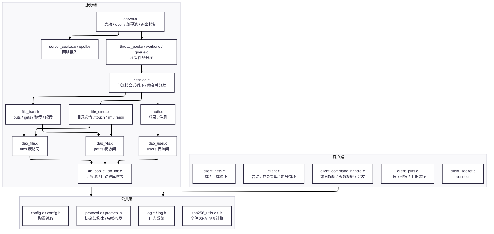
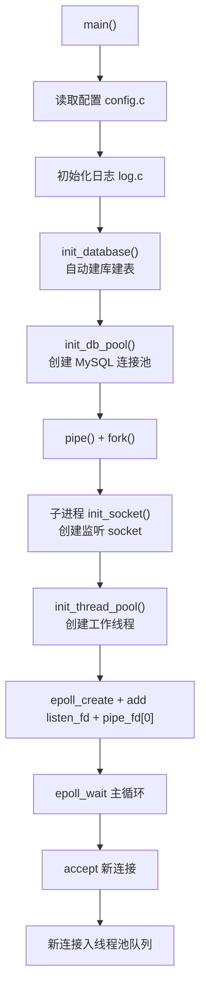
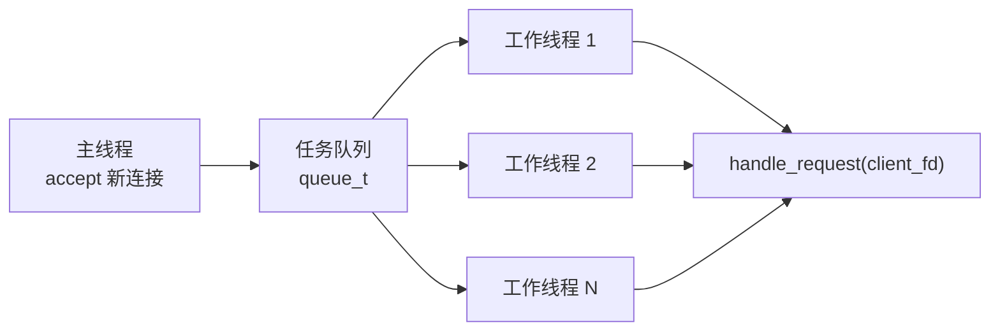
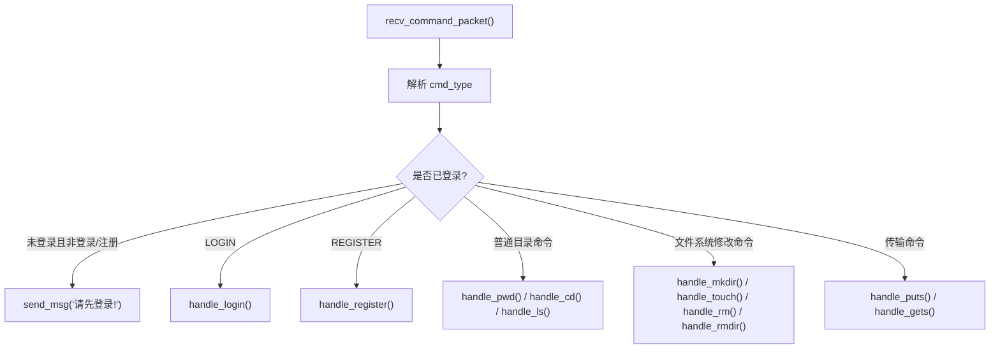
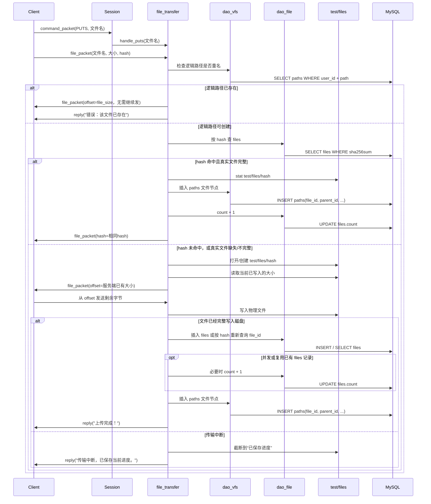
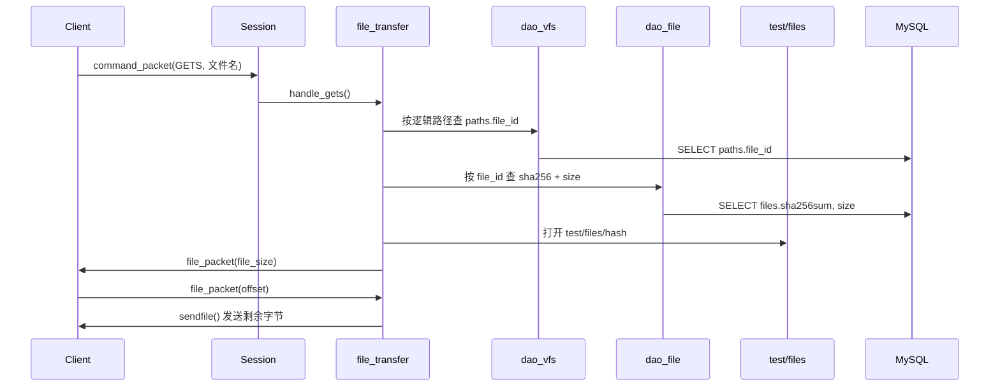
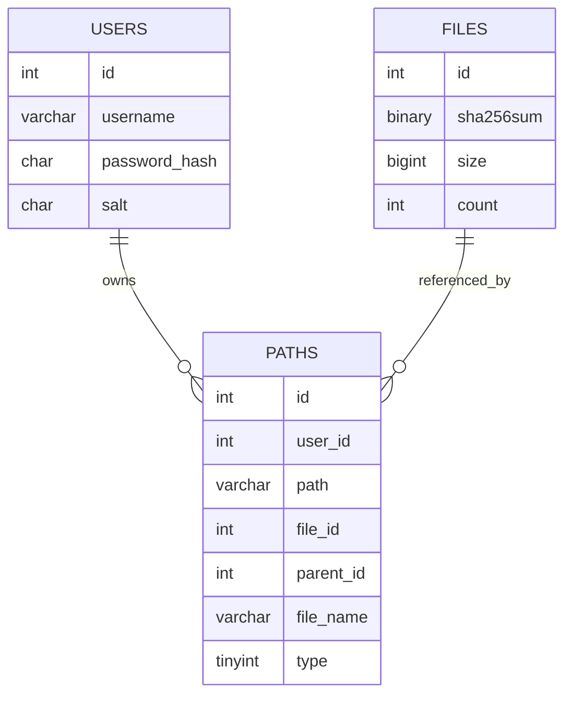
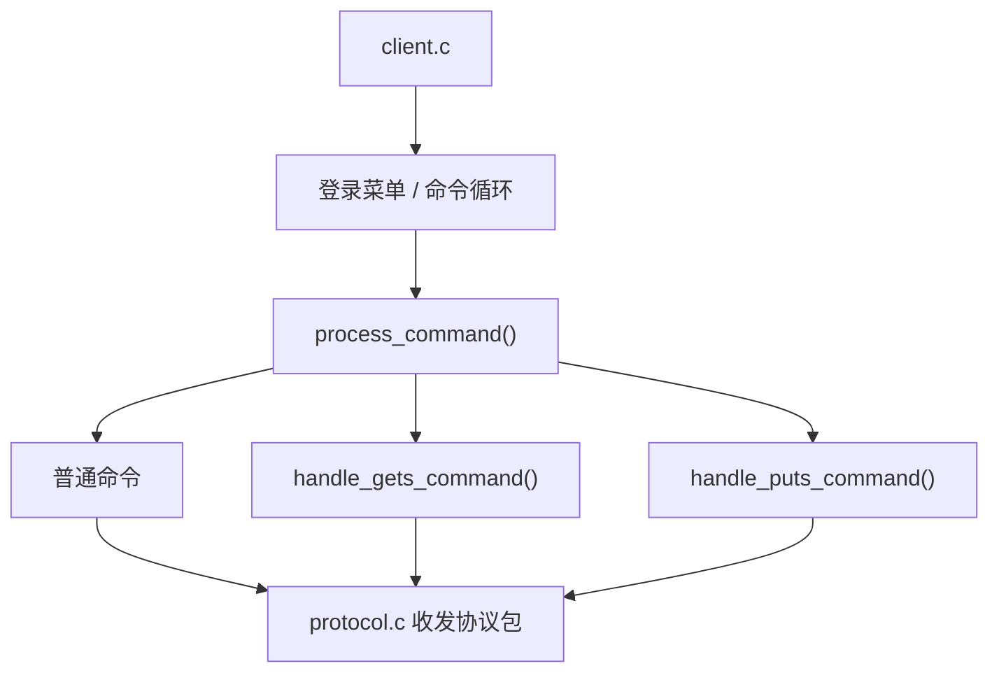

# WindCloud_V3 整体项目架构详解

## 1. 文档目标

这份文档不是“理想化分层图”，而是基于当前仓库代码的**真实实现**来解释：

1. 客户端和服务端分别由哪些模块组成
2. 模块之间如何调用
3. 一条命令从终端输入到写入数据库，具体经过哪些层
4. 虚拟目录、真实文件、协议、线程池、数据库连接池分别扮演什么角色

当前版本已经包含：

- 登录 / 注册
- 虚拟目录命令：`pwd`、`cd`、`ls`、`mkdir`、`touch`、`rm`、`rmdir`
- 文件上传 `puts`
- 文件下载 `gets`
- 断点续传
- 基于 SHA-256 的秒传 / 去重
- `touch` 创建空文件时同步维护 `files` 与 `paths`
- 客户端按“分发 / 上传 / 下载”拆分后的结构

---

## 2. 总体架构总览

### 2.1 逻辑分层图



### 2.2 当前项目可以映射成的“推荐分层”

虽然仓库目录没有严格按层命名，但从职责上可以清楚映射到下面这组分层：

| 分层 | 当前模块 |
| --- | --- |
| 协议层 `protocol` | `include/protocol.h`、`src/common/protocol.c` |
| 会话层 `session` | `src/server/session.c`、`ClientContext` |
| 业务层 `auth / file_cmds / file_transfer` | `src/server/auth.c`、`src/server/file_cmds.c`、`src/server/file_transfer.c` |
| DAO层 `dao_user / dao_vfs / dao_file` | `src/server/dao_user.c`、`src/server/dao_vfs.c`、`src/server/dao_file.c` |
| 基建层 `thread_pool / db_pool / log / config / socket` | `thread_pool.c`、`worker.c`、`queue.c`、`db_pool.c`、`db_init.c`、`log.c`、`config.c`、`server_socket.c`、`epoll.c` |

这里最关键的理解是：

- **协议层**解决“怎么发”
- **会话层**解决“当前这个连接是谁、在哪”
- **业务层**解决“这条命令要做什么”
- **DAO层**解决“数据库怎么查和改”
- **基建层**解决“线程、日志、配置、连接池、socket 怎么运转”

---

## 3. 目录与模块组织

### 3.1 源码目录

```text
include/
├── protocol.h
├── client_command_handle.h
├── client_socket.h
├── auth.h
├── file_cmds.h
├── file_transfer.h
├── dao_user.h
├── dao_vfs.h
├── dao_file.h
├── db_pool.h
├── db_init.h
├── thread_pool.h
├── queue.h
├── worker.h
├── server_socket.h
├── epoll.h
├── path_utils.h
├── config.h
├── log.h
└── sha256_utils.h

src/client/
├── client.c
├── client_command_handle.c
├── client_gets.c
├── client_puts.c
└── client_socket.c

src/server/
├── server.c
├── server_socket.c
├── epoll.c
├── thread_pool.c
├── worker.c
├── queue.c
├── session.c
├── auth.c
├── file_cmds.c
├── file_transfer.c
├── dao_user.c
├── dao_vfs.c
├── dao_file.c
├── db_pool.c
├── db_init.c
└── path_utils.c

src/common/
├── protocol.c
├── config.c
├── log.c
└── sha256_utils.c
```

### 3.2 模块关系的一个关键事实

这个项目并不是“客户端直接操作本地真实目录，服务端直接操作服务器真实目录”。

它实际上维护两套系统：

1. **逻辑文件系统**
   - 面向用户
   - 保存到数据库 `paths`
   - 支持 `cd` / `ls` / `mkdir` / `touch`
2. **真实文件系统**
   - 面向服务端存储
   - 保存到 `test/files/<sha256>`
   - 只按内容哈希存储，不按用户名和目录存储

因此项目本质上是：

> 协议驱动的虚拟文件系统 + 去重存储系统

---

## 4. 服务端架构详解

## 4.1 服务端启动链

服务端入口是 `src/server/server.c`。

启动顺序如下：



启动过程中几个特别重要的点：

### A. 服务端不是单进程死循环直跑

`server.c` 里先 `pipe()` 再 `fork()`：

- 父进程负责接收 `SIGINT`
- 子进程负责真正跑服务端主逻辑
- 父进程通过管道通知子进程退出

所以当前服务端是一个“父进程控制退出、子进程执行业务”的结构。

### B. `epoll` 不负责处理所有业务

这里的 `epoll` 只负责两类事件：

1. `listen_fd` 有新连接
2. `pipe_fd[0]` 收到退出通知

它不负责读写每个客户端连接上的命令数据。

这意味着当前项目的并发策略不是“epoll 驱动所有 IO”，而是：

> `epoll` 负责接入，线程池负责连接级会话处理

### C. 数据库表会在服务端启动时自动校验 / 创建

`db_init.c` 会自动创建：

- `users`
- `files`
- `paths`

所以数据库不是手工前置依赖，而是服务端启动时自动保证存在。

---

## 4.2 线程池与连接处理模型

线程池由三部分组成：

- `thread_pool.c`：线程池初始化与销毁
- `worker.c`：工作线程主循环
- `queue.c`：保存待处理 `client_fd` 的任务队列

### 4.2.1 并发模型



### 4.2.2 当前线程池的工作方式

主线程做的事情：

1. `accept()` 新连接
2. 把 `client_fd` 入队
3. `pthread_cond_signal()` 唤醒一个工作线程

工作线程做的事情：

1. 队列为空时睡眠
2. 醒来后取出一个 `client_fd`
3. 在 `busy_fds` 中登记自己正在处理哪个 fd
4. 调用 `handle_request(client_fd)`
5. 客户端断开后关闭 fd
6. 把 `busy_fds` 置回 `-1`

### 4.2.3 为什么说它是“连接级线程池”

因为当前模型不是“每条命令一个任务”，而是：

- 一个连接进入队列
- 一个线程拿走这个连接
- 线程在 `handle_request()` 中持续服务这个连接，直到断开

所以这里的线程池更接近：

> 线程池负责连接级会话，不是短任务级 RPC 池

这也是为什么 `session.c` 这么关键。

---

## 4.3 会话层 `session.c`

`src/server/session.c` 是整个服务端业务调度的枢纽。

### 4.3.1 `ClientContext` 是什么

当前定义在 `include/protocol.h`：

```c
typedef struct{
    int user_id;
    char current_path[256];
    int current_dir_id;
} ClientContext;
```

这个结构体保存的是**单个客户端连接的会话态**：

- `user_id`
  - 当前连接登录后的用户 ID
- `current_path`
  - 当前逻辑路径，例如 `/doc/work`
- `current_dir_id`
  - 当前所在目录节点 ID
  - 根目录约定为 `0`

### 4.3.2 会话层的职责

`handle_request()` 负责：

1. 初始化当前连接的 `ClientContext`
2. 循环接收 `command_packet_t`
3. 校验未登录态是否允许执行命令
4. 根据 `cmd_type` 分发到不同业务函数

### 4.3.3 命令分发图



### 4.3.4 为什么 `ClientContext` 很关键

因为它把“字符串路径”和“目录节点 ID”同时缓存了下来：

- `current_path` 负责给 `pwd`、路径拼接、日志使用
- `current_dir_id` 负责给 `ls`、`mkdir`、`touch`、`puts` 等场景使用

这使得后面的业务函数不需要每次都重新推导“当前目录是谁”。

---

## 5. 业务层架构详解

业务层由三条主线组成：

- `auth.c`
- `file_cmds.c`
- `file_transfer.c`

它们都由 `session.c` 统一调度。

## 5.1 认证业务 `auth.c`

### 5.1.1 注册

注册流程：

1. 从 `用户名/密码` 字符串中拆出用户名和密码
2. 生成随机盐 `salt`
3. 计算 `SHA256(password + salt)`
4. 调用 `dao_insert_user()`
5. 再查一次用户，把新 `user_id` 回填

### 5.1.2 登录

登录流程：

1. 通过用户名调用 `dao_get_user_by_name()`
2. 取回 `password_hash` 和 `salt`
3. 用用户输入密码重新计算加盐哈希
4. 比较是否一致
5. 一致则把 `ctx.user_id` 设为数据库用户 ID

### 5.1.3 登录成功后的会话重置

`session.c` 中登录成功后会重置：

- `ctx.current_path = "/"`
- `ctx.current_dir_id = 0`

因此登录态的目录上下文总是从根目录开始。

---

## 5.2 虚拟文件系统命令 `file_cmds.c`

这个模块负责：

- `pwd`
- `ls`
- `cd`
- `mkdir`
- `touch`
- `rm`
- `rmdir`

### 5.2.1 路径处理策略

这里操作的都是**虚拟路径**，不是 Linux 进程当前目录。

例如执行：

```text
cd work
```

实际做的是：

1. 用 `current_path` 和参数拼逻辑路径
2. 到 `paths` 表里查目标节点
3. 判断是不是目录
4. 更新 `ctx.current_path` 和 `ctx.current_dir_id`

并不会调用 `chdir()`。

### 5.2.2 `ls`

`ls` 的本质是：

```text
根据 user_id + current_dir_id
查询 paths 表中 parent_id = current_dir_id 的所有子节点
```

所以 `current_dir_id` 的真实语义是：

> 当前所在目录自己的节点 ID

### 5.2.3 `mkdir`

`mkdir` 会：

1. 先判断目标逻辑路径是否已存在
2. 再调用 `dao_create_node(..., type=1)`
3. 在 `paths` 中插入目录节点

这里目录没有真实文件实体，所以不会写 `files` 表。

### 5.2.4 `touch`

当前版本的 `touch` 已经不是“只往 `paths` 塞一条文件记录”了。

现在的行为是：

1. 检查目标逻辑路径是否已存在
2. 确保空文件对应的真实文件 `test/files/<空文件SHA256>` 存在
3. 在 `files` 表中复用或创建空文件记录
4. 用 `dao_create_file_node()` 在 `paths` 中写入带 `file_id` 的逻辑文件节点
5. 如已有空文件记录，则把 `files.count + 1`

因此 `touch` 当前已经和 `gets` / `puts` / 秒传设计对齐。

### 5.2.5 `rm` 与 `rmdir`

当前删除逻辑已经分成“逻辑节点删除”和“真实文件回收”两部分：

- `rm`
  - 校验目标必须是普通文件
  - 先根据逻辑路径查出对应 `file_id`
  - 调用 `dao_delete_node()` 删除 `paths` 逻辑节点
  - 调用 `release_file_entity_if_unused()` 维护 `files.count`
  - 当 `count = 0` 时继续回收 `files` 记录和 `test/files/<sha256>` 真实文件
- `rmdir`
  - 校验目标必须是目录
  - 用 `dao_is_dir_empty()` 确认目录为空
  - 再删除目录节点

因此当前版本的 `rm` 已经和“逻辑文件节点 + 真实文件实体”的设计保持一致，不再只是删除 `paths` 表记录。

---

## 5.3 文件传输业务 `file_transfer.c`

这是项目中最复杂、最关键的模块。

它负责：

- `gets`
- `puts`
- 断点续传
- SHA-256 秒传
- 虚拟路径与真实文件之间的桥接

### 5.3.1 真实文件存储策略

真实文件统一存放在：

```text
test/files/<sha256>
```

其特点是：

1. 文件名不是用户原名，而是内容哈希
2. 逻辑目录树和物理存储完全解耦
3. 相同内容天然共用一份物理文件

### 5.3.2 上传 `puts` 的完整链路



### 5.3.3 上传中的关键设计点

#### A. 协议是两段式

客户端先发：

1. `command_packet_t`
2. `file_packet_t`

所以服务端 `handle_puts()` 必须先收文件包，协议才能对齐。

#### B. 秒传的判断依据不只是 `files.sha256sum`

如果 `dao_file_find_by_sha256()` 找到同哈希文件，还要继续检查：

1. `test/files/<hash>` 是否存在
2. 它是否是普通文件
3. 它的大小是否和 `files.size` 一致

只有“数据库记录存在 + 真实文件完整”时才会真正秒传：

- 不再进入文件内容传输循环
- 只补逻辑节点
- 引用计数 `count + 1`

如果数据库有 hash 记录，但真实文件缺失或只有半截，就会退化为正常上传 / 续传。

#### C. 断点续传依赖真实磁盘残留文件

服务端会检查：

```text
test/files/<hash>
```

当前已有多少字节，然后把 `offset` 回给客户端，客户端从该位置继续发。

这条设计现在同时覆盖两种情况：

1. 普通上传中断后再次续传
2. 数据库里已有 hash 记录，但真实文件不完整时，退化成“修复式续传”

#### D. 数据库写入被推迟到“文件完整”之后

只有在以下几种情况才会补 `files` / `paths`：

1. 秒传
2. 磁盘上该 hash 文件已经完整
3. 本次网络传输完整收满
4. 空文件上传

这样可以避免把半截文件误认为完整文件。

### 5.3.4 下载 `gets` 的完整链路



### 5.3.5 下载中的关键设计点

下载链路不是：

```text
文件名 -> 磁盘文件
```

而是：

```text
文件名 -> 逻辑路径 -> paths.file_id -> files.sha256 -> 真实磁盘文件
```

这正是“逻辑目录与物理文件分离”的核心体现。

---

## 6. DAO 层架构详解

DAO 层把数据库访问拆成了三类：

- 用户表 DAO
- 虚拟文件系统 DAO
- 真实文件 DAO

## 6.1 `dao_user.c`

只负责 `users` 表：

- `dao_get_user_by_name()`
- `dao_insert_user()`

也就是说，认证业务并不直接拼 SQL，而是通过用户 DAO 完成。

## 6.2 `dao_vfs.c`

只负责 `paths` 表，也就是虚拟目录树：

- `dao_get_node_by_path()`
- `dao_list_dir()`
- `dao_create_node()`
- `dao_create_file_node()`
- `dao_get_file_info_by_path()`
- `dao_is_dir_empty()`
- `dao_delete_node()`

这里有个很重要的约定：

### 根目录不是 `paths` 表里的真实记录

项目把根目录 `/` 约定为：

- `id = 0`
- `type = 1`

但数据库中并不会真的插一条“根目录记录”。

所以当前目录在根目录时：

- `ctx.current_dir_id = 0`
- 根下所有顶层节点在数据库里的 `parent_id = 0`

这使整个树结构在逻辑上保持自洽。

## 6.3 `dao_file.c`

只负责 `files` 表：

- `dao_file_find_by_sha256()`
- `dao_file_insert()`
- `dao_file_add_ref_count()`
- `dao_file_sub_ref_count()`
- `dao_file_get_ref_count()`
- `dao_file_delete()`
- `dao_file_get_info_by_id()`

这一层解决的是：

- 某份真实文件是否已存在
- 真实文件的 `id` 是多少
- 它的 `size` 是多少
- 它被多少逻辑节点引用

---

## 7. 数据库模型详解

当前数据库是 `netdisk_db`，核心三张表：

## 7.1 `users`

表示账号系统。

关键字段：

- `id`
- `username`
- `password_hash`
- `salt`

## 7.2 `files`

表示**真实文件实体**。

关键字段：

- `id`
- `sha256sum`
- `size`
- `count`

语义：

- 一份内容只保存一条 `files` 记录
- 多个用户 / 多个目录中的同内容文件，可以共用这条记录
- `count` 表示当前有多少个逻辑文件节点引用这份真实文件

## 7.3 `paths`

表示**用户看到的虚拟目录树**。

关键字段：

- `id`
- `user_id`
- `path`
- `file_id`
- `parent_id`
- `file_name`
- `type`

语义：

- `type = 1`
  - 目录
  - `file_id = NULL`
- `type = 0`
  - 普通文件
  - `file_id` 指向 `files.id`

### 7.3.1 三张表的关系图



### 7.3.2 一个典型例子

假设用户 5 的网盘里有：

```text
/
└── doc
    └── a.txt
```

那么数据库上大致会表现成：

#### `paths`

- `/doc`
  - `id = 10`
  - `parent_id = 0`
  - `type = 1`
- `/doc/a.txt`
  - `id = 11`
  - `parent_id = 10`
  - `type = 0`
  - `file_id = 3`

#### `files`

- `id = 3`
  - `sha256sum = ...`
  - `size = ...`
  - `count = 1`

这说明：

- 目录树结构靠 `paths.parent_id`
- 普通文件与真实文件的连接靠 `paths.file_id`

---

## 8. 协议层架构详解

协议层定义在：

- `include/protocol.h`
- `src/common/protocol.c`

## 8.1 两种协议包

### 8.1.1 `command_packet_t`

用于普通命令和普通文本响应。

字段：

- `cmd_type`
- `data_len`
- `data`

适用场景：

- `pwd`
- `cd`
- `ls`
- `mkdir`
- `touch`
- `rm`
- `rmdir`
- `login`
- `register`
- 普通文本响应

### 8.1.2 `file_packet_t`

用于文件传输协商。

字段：

- `cmd_type`
- `data_len`
- `file_size`
- `offset`
- `file_name`
- `hash`

适用场景：

- 上传前发送文件大小和 hash
- 下载前返回文件大小
- 协商断点续传偏移
- 秒传时回传相同 hash 作为完成标志

## 8.2 为什么要封装 `send_full()` / `recv_full()`

因为一次 `send()` / `recv()` 并不能保证完整传完一个结构体。

所以公共协议层封装了：

- `send_full()`
- `recv_full()`
- `send_command_packet()`
- `recv_command_packet()`
- `send_file_packet()`
- `recv_file_packet()`

这样客户端和服务端都按“固定结构体长度”收发，不会因为半包问题直接错位。

---

## 9. 客户端架构详解

当前客户端经过拆分后，结构已经比较清晰。

## 9.1 客户端模块分工

| 文件 | 职责 |
| --- | --- |
| `client.c` | 启动、读配置、连接服务端、登录菜单、命令主循环 |
| `client_socket.c` | `connect()` 建立 TCP 连接 |
| `client_command_handle.c` | 解析输入、校验参数、命令分发、普通命令发送与文本响应接收 |
| `client_gets.c` | 下载命令和下载断点续传 |
| `client_puts.c` | 上传命令、秒传、上传断点续传 |

## 9.2 客户端调用链



## 9.3 客户端的会话特点

客户端本地并不维护像服务端那样完整的目录上下文状态。

它的职责是：

1. 读取用户输入
2. 发送命令和参数
3. 根据协议配合服务端完成上传下载
4. 把文本结果打印出来

目录状态真正由服务端 `ClientContext` 持有。

这意味着当前设计是：

> 客户端是“命令发起者”，服务端才是“目录会话状态持有者”

---

## 10. 典型调用链总览

## 10.1 普通目录命令调用链

以 `mkdir demo` 为例：

```text
client.c
-> process_command()
-> send_command_packet()
-> server session.c: handle_request()
-> file_cmds.c: handle_mkdir()
-> dao_vfs.c: dao_create_node()
-> db_pool.c: db_execute_update()
-> MySQL
```

## 10.2 上传调用链

```text
client.c
-> process_command()
-> client_puts.c: handle_puts_command()
-> protocol.c 发送 command_packet + file_packet
-> session.c: handle_request()
-> file_transfer.c: handle_puts()
-> dao_vfs 查重名逻辑路径
-> dao_file 查 hash / 维护 files.count
-> MySQL
-> test/files/<sha256>
-> 服务端回复
-> 客户端接收最终结果
```

## 10.3 下载调用链

```text
client.c
-> process_command()
-> client_gets.c: handle_gets_command()
-> protocol.c 发送 GETS 请求
-> session.c: handle_request()
-> file_transfer.c: handle_gets()
-> dao_vfs 查 file_id
-> dao_file 查 sha256
-> MySQL
-> test/files/<sha256>
-> sendfile() 回传数据
-> 客户端写入本地文件
```

---

## 11. 当前架构的优点

### 11.1 职责边界已经比较清楚

虽然项目是学习型工程，但已经形成了清晰的职责边界：

- 网络接入
- 会话调度
- 业务处理
- DAO
- 公共工具

### 11.2 虚拟目录和真实文件彻底解耦

这使得：

- 秒传容易实现
- 去重容易实现
- 下载定位真实文件也很稳定

### 11.3 客户端和服务端协议统一

固定大小结构体 + 完整收发函数，让协议实现非常直观。

### 11.4 客户端拆分后可维护性提高

上传、下载、分发不再全部挤在一个 400 多行文件里，后续继续扩展命令时更容易维护。

---

## 12. 当前架构下仍然值得继续优化的点

下面这些不是“当前文档要求必须修改”的内容，而是基于现架构的进一步优化方向。

### 12.1 删除链路的异常回滚仍可继续增强

当前 `rm` 已经补齐了：

- 删除 `paths` 逻辑节点
- 维护 `files.count`
- 在引用计数归零时回收 `files` 记录和 `test/files/<sha256>` 真实文件

但如果要进一步增强健壮性，仍可以继续完善：

1. `dao_delete_node()` 成功后、真实文件回收失败时的补救策略
2. 删除链路里的更细粒度错误区分
3. 把“删逻辑节点 + 改引用计数 + 回收真实文件”包装成更稳定的一组操作

### 12.2 SQL 仍然是直接拼接

这让代码直观，但真实工程里还可以继续升级为：

- 参数化查询
- 统一转义
- 更细的错误类型区分

### 12.3 事务控制仍然较轻

像“插 `paths` + 改 `files.count`”这类多步数据库写操作，目前还没有做事务包裹。

### 12.4 `file_cmds.c` 和 `file_transfer.c` 中有部分重复的存储路径工具

当前两个模块都维护了“真实文件仓库路径”的辅助逻辑。

后续可以考虑抽到独立公共模块，例如：

- `store_utils.c`
- `vfs_path.c`

### 12.5 当前是连接级线程模型，不是完全事件驱动模型

对学习项目来说这没有问题，而且更容易理解。

但如果后续追求更高连接规模，可以进一步评估：

- 线程数量
- 阻塞数据库访问
- 更细粒度的异步 IO 模型

---

## 13. 一句话总结当前架构

`WindCloud_V3` 当前可以概括为：

> 一个基于固定协议结构体通信、由 `epoll + 线程池` 接入、在服务端用 `ClientContext` 维护目录会话、以 `paths` 表表示虚拟目录树、以 `files` 表表示真实文件实体、并通过 SHA-256 实现去重和秒传的 C 语言网盘系统。

如果要抓住它最核心的五个关键词，就是：

1. **协议统一**
2. **连接级会话**
3. **虚拟目录**
4. **真实文件去重**
5. **上传下载断点续传**
