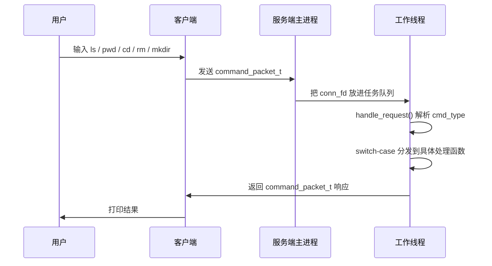
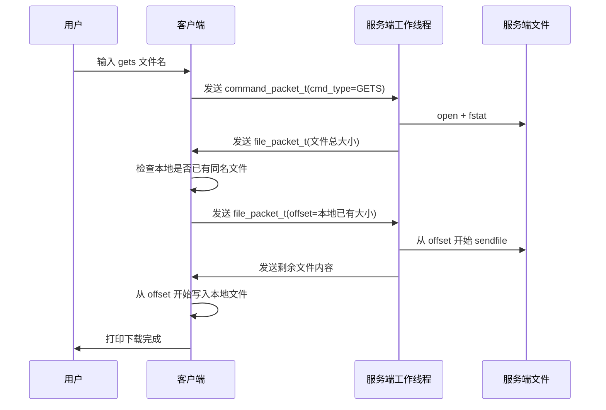
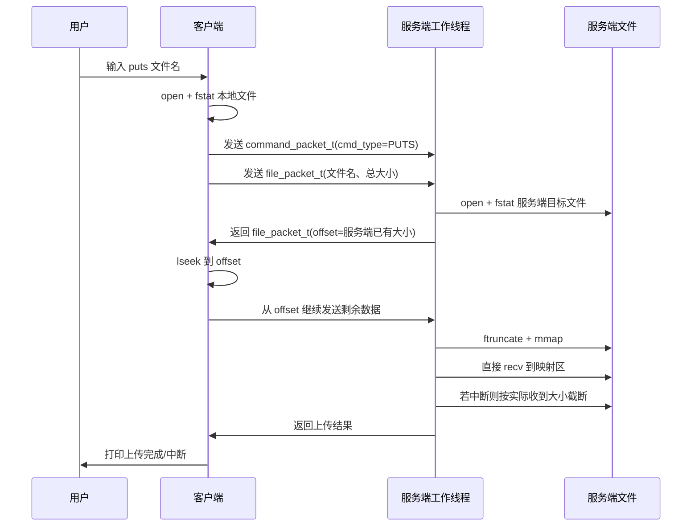

# 项目第一二期学习文档

本文档只讲当前项目已经实现的第一期、第二期核心内容：

1. 客户端和服务端的基础命令交互。
2. 配置文件读取。
3. 基础日志体系。
4. 线程池 + epoll 的并发处理模型。
5. 文件上传、下载、断点续传。
6. `mmap` 与 `sendfile` 在文件传输中的使用。

下面这些内容 **不属于本文档范围**：

1. 真实多用户系统。
2. 数据库。
3. JWT 鉴权。
4. 多点下载。
5. 第三期到第五期的其他扩展功能。

---

## 一、项目总体目标

这个项目本质上是一个“简化版网盘/远程文件管理系统”。

它的核心目标很直接：

1. 客户端连接服务端。
2. 客户端输入命令。
3. 服务端解析命令。
4. 服务端对自己本地的 `./upload` 目录执行文件操作。
5. 把结果或者文件内容返回给客户端。

当前已经实现的命令有：

1. `pwd`
2. `cd`
3. `ls`
4. `gets`
5. `puts`
6. `rm`
7. `mkdir`

可以把它理解成：

- 客户端是“远程控制台”
- 服务端是“真正操作文件的人”

客户端输入的命令，并不是操作客户端本地目录，而是操作服务端 `./upload` 下面的内容。

---

## 二、项目目录结构

当前项目主要分成 3 部分：

1. `src/client`
2. `src/server`
3. `src/common`

### 2.1 `src/client`

客户端相关代码：

1. `client.c`
   作用：客户端主函数，负责读取配置、连接服务器、读取用户输入。
2. `client_socket.c`
   作用：创建客户端 socket，并调用 `connect()` 和服务器建立 TCP 连接。
3. `client_command_handle.c`
   作用：解析用户命令、打包命令结构体、处理上传下载逻辑、接收服务端响应。

### 2.2 `src/server`

服务端相关代码：

1. `server.c`
   作用：服务端主函数，负责读配置、创建监听 socket、创建线程池、使用 `epoll` 监听事件、处理退出。
2. `server_socket.c`
   作用：创建监听 socket，`bind + listen`。
3. `handle.c`
   作用：服务端命令分发中心，所有客户端命令最终都在这里处理。
4. `thread_pool.c`
   作用：初始化线程池。
5. `worker.c`
   作用：线程池里的工作线程函数，真正处理客户端连接。
6. `queue.c`
   作用：保存等待处理的客户端 `fd`。
7. `epoll.c`
   作用：封装 `epoll_ctl` 的增删操作。

### 2.3 `src/common`

公共模块：

1. `config.c`
   作用：读取配置文件里的 `ip=...`、`port=...`。
2. `log.c`
   作用：基础日志输出。
3. `protocol.c`
   作用：封装命令协议、文件协议、完整收发函数。

### 2.4 `include`

头文件目录，放结构体定义、函数声明、宏定义。

---

## 三、项目运行总流程

先看一句话版：

1. 服务端启动，监听端口。
2. 客户端启动，连接服务端。
3. 客户端输入命令。
4. 命令被打包成结构体发送到服务端。
5. 服务端工作线程收到命令后，根据命令类型执行不同处理函数。
6. 如果是普通命令，服务端返回文本结果。
7. 如果是文件命令，服务端和客户端会按文件传输协议继续交互。

---

## 四、服务端与客户端总体时序图

### 4.1 普通命令时序图



### 4.2 下载 `gets` 时序图



### 4.3 上传 `puts` 时序图



---

## 五、模块架构讲解

### 5.1 服务端主控模块

服务端主函数在 `src/server/server.c`。

它做了几件很重要的事情：

1. 初始化日志。
2. 读取配置文件里的 IP 和端口。
3. 创建监听 socket。
4. 创建线程池。
5. 创建 `epoll`。
6. 监听两个事件源：
   - `listen_fd`
   - `pipe_fd[0]`

为什么要监听这两个？

1. `listen_fd`
   作用：监听新的客户端连接。
2. `pipe_fd[0]`
   作用：监听退出信号。

服务端这里用了一个“父子进程 + 管道”的退出方案：

1. 父进程专门等 `SIGINT`。
2. 收到 `Ctrl+C` 后，父进程往管道写一个字节。
3. 子进程的 `epoll` 监听到了管道可读。
4. 子进程进入退出流程：
   - 设置线程池退出标记
   - 关闭排队中的连接
   - `shutdown` 正在处理的连接
   - 唤醒线程
   - `join` 所有工作线程

这样做的目的，是尽量让服务端优雅退出，而不是粗暴崩掉。

### 5.2 线程池模块

线程池相关代码在：

1. `thread_pool.c`
2. `worker.c`
3. `queue.c`

线程池结构体里最重要的成员有：

1. `thread_id_arr`
   作用：保存线程 ID。
2. `queue`
   作用：保存还没处理的客户端连接。
3. `lock`
   作用：保护任务队列。
4. `cond`
   作用：当队列为空时，让线程睡眠等待。
5. `exitFlag`
   作用：通知线程池退出。
6. `busy_fds`
   作用：记录每个工作线程当前正在处理哪个客户端 `fd`。

工作流程是：

1. 主线程 `accept()` 新连接。
2. 把 `conn_fd` 放入队列。
3. 唤醒一个工作线程。
4. 工作线程从队列拿出 `fd`。
5. 调用 `handle_request(fd)` 处理整个客户端会话。

注意这里的线程模型：

它不是“处理一个命令就还回线程池”，而是“一个线程拿到一个连接后，会持续处理这个连接里的多条命令，直到客户端断开”。

这点很重要，因为这会影响退出机制的设计。

### 5.3 协议模块

协议代码在 `protocol.h` 和 `protocol.c`。

这里是第二阶段最重要的改造之一。

以前的问题是：

1. 有时候发长度再发内容。
2. 有时候直接发 `off_t`。
3. 有时候再单独发字符串。
4. 上传下载双方协议并不完全对称。

这样很容易产生：

1. TCP 粘包/半包问题。
2. 协议错位。
3. 客户端和服务端互相等死。

现在统一成两种结构体：

### 5.3.1 普通命令结构体 `command_packet_t`

字段：

1. `cmd_type`
   表示命令类型。
2. `data_len`
   表示 `data` 中有效字节数。
3. `data`
   普通命令的参数，或者服务端返回的文本消息。

适用场景：

1. `pwd`
2. `cd`
3. `ls`
4. `rm`
5. `mkdir`
6. 服务端文本响应

### 5.3.2 文件传输结构体 `file_packet_t`

字段：

1. `cmd_type`
   表示这是 `puts` 还是 `gets`。
2. `data_len`
   文件名有效长度。
3. `file_size`
   文件总大小。
4. `offset`
   断点续传位置。
5. `file_name`
   文件名。

适用场景：

1. `gets` 下载握手。
2. `puts` 上传握手。

### 5.3.3 为什么还要写 `send_full` 和 `recv_full`

很多新手容易误解：

“我一次 `send()`，对面就会一次 `recv()` 收全。”

这是错误的。

TCP 是字节流协议，不关心“消息边界”。

这意味着：

1. 你发 100 字节，对方可能一次只收到 30 字节。
2. 也可能你连续发两次，对方一次就读到了两段内容。

所以协议代码里必须自己保证：

1. 该发完的内容一定循环发完。
2. 该收满的结构体一定循环收满。

这就是 `send_full` 和 `recv_full` 的意义。

---

## 六、命令分发逻辑

服务端命令入口在 `handle_request()`。

当前处理流程是：

1. 从 socket 完整接收一个 `command_packet_t`。
2. 读取里面的 `cmd_type`。
3. 用 `switch-case` 分发。

为什么这里使用 `enum + switch-case` 比 `if-else if (strcmp)` 更适合？

原因很简单：

1. 分支更清晰。
2. 阅读成本更低。
3. 后续新增命令时更方便。
4. 客户端和服务端协议统一后，不需要每次都对字符串反复比较。

---

## 七、每个命令的实现逻辑

这一部分是学习重点。

---

## 八、`pwd` 命令

### 8.1 作用

显示客户端当前所在的“虚拟路径”。

### 8.2 注意

这个路径不是服务端真实的磁盘绝对路径。

例如服务端真实目录可能是：

```text
./upload/dir1
```

但客户端看到的是：

```text
/dir1
```

这是一个“虚拟路径”的概念。

### 8.3 执行流程

1. 客户端发送 `command_packet_t(cmd_type=PWD)`。
2. 服务端 `handle_request()` 进入 `case CMD_TYPE_PWD`。
3. 调用 `handle_pwd()`。
4. `handle_pwd()` 直接把当前的 `current_path` 返回给客户端。

### 8.4 学习重点

这里虽然简单，但它体现了一个重要思想：

客户端看到的路径，不一定等于服务端真实路径。

---

## 九、`cd` 命令

### 9.1 作用

切换客户端当前的虚拟目录。

### 9.2 当前实现特点

当前实现是简化版：

1. `cd ..` 直接回根目录 `/`
2. 不做复杂多级回退
3. 不做真正的目录森林和多用户隔离

这是故意保持简单，适合学习。

### 9.3 执行流程

1. 客户端发送 `command_packet_t(cmd_type=CD, data=目录名)`。
2. 服务端调用 `handle_cd()`。
3. `handle_cd()` 先检查参数是否合法。
4. 如果参数是 `..`，直接把 `current_path` 改成 `/`。
5. 否则把当前虚拟路径和参数拼成真实路径。
6. 调用 `opendir()` 测试目录是否存在。
7. 如果存在，就更新 `current_path`。
8. 返回“进入目录成功”。

### 9.4 学习重点

这里最值得学的是“两套路径”：

1. 虚拟路径：给客户端看。
2. 真实路径：服务端真正访问磁盘时使用。

---

## 十、`ls` 命令

### 10.1 作用

列出当前目录下的文件和文件夹名称。

### 10.2 执行流程

1. 客户端发送 `command_packet_t(cmd_type=LS)`。
2. 服务端调用 `handle_ls()`。
3. 把虚拟路径转换成真实路径。
4. 用 `opendir()` 打开目录。
5. 用 `readdir()` 逐个读取目录项。
6. 跳过 `.` 和 `..`。
7. 把文件名拼接到结果字符串里。
8. `closedir()` 关闭目录流。
9. 把结果文本返回客户端。

### 10.3 学习重点

#### 10.3.1 为什么要跳过 `.` 和 `..`

因为：

1. `.` 代表当前目录。
2. `..` 代表父目录。

如果不跳过，显示结果会很乱。

#### 10.3.2 为什么不能无脑 `strcat`

因为固定长度数组会溢出。

所以这里改成了 `snprintf` + 剩余长度判断。

这说明一个初学者很容易忽略的问题：

“字符串能拼出来”和“字符串拼接安全”不是一回事。

---

## 十一、`rm` 命令

### 11.1 作用

删除服务端当前目录下的目标文件。

### 11.2 执行流程

1. 客户端发送 `command_packet_t(cmd_type=RM, data=文件名)`。
2. 服务端调用 `handle_rm()`。
3. 把虚拟路径和文件名拼接成真实路径。
4. 调用 `remove()` 删除。
5. 把成功或失败信息返回给客户端。

### 11.3 学习重点

这里看起来很简单，但它也依赖路径安全检查。

如果不拦截 `..`，客户端就可能删掉 `upload` 目录之外的文件。

所以这个命令虽然代码少，但安全边界非常重要。

---

## 十二、`mkdir` 命令

### 12.1 作用

在当前目录下创建一个新文件夹。

### 12.2 执行流程

1. 客户端发送 `command_packet_t(cmd_type=MKDIR, data=目录名)`。
2. 服务端调用 `handle_mkdir()`。
3. 拼接真实路径。
4. 调用 `mkdir(real_path, 0755)`。
5. 把结果返回给客户端。

### 12.3 学习重点

这个命令主要学习两个点：

1. 路径拼接。
2. Linux 文件权限参数。

`0755` 的含义是：

1. 文件所有者：可读可写可执行。
2. 同组用户：可读可执行。
3. 其他用户：可读可执行。

---

## 十三、`gets` 下载命令

这是项目里第一块真正进入“文件传输协议”的功能。

### 13.1 作用

从服务端下载一个文件到客户端本地。

### 13.2 下载为什么比普通命令复杂

普通命令只需要传一条文本结果。

但是下载命令要解决这些问题：

1. 文件是否存在？
2. 文件总大小是多少？
3. 客户端本地是否已有部分内容？
4. 从哪里开始继续传？
5. 文件内容怎样高效发送？

### 13.3 `gets` 完整流程

#### 第一步：客户端先发普通命令结构体

客户端发送：

```text
command_packet_t
cmd_type = CMD_TYPE_GETS
data = 文件名
```

服务端收到后进入 `handle_gets()`。

#### 第二步：服务端返回文件信息结构体

服务端打开目标文件。

如果失败：

1. 返回 `file_packet_t`
2. `file_size = -1`

如果成功：

1. 用 `fstat()` 取出文件总大小
2. 返回 `file_packet_t`
3. 把总大小放进 `file_size`

#### 第三步：客户端决定断点位置

客户端检查本地是否已有同名文件。

情况分 3 类：

1. 本地没有文件
   说明从 0 开始下载。
2. 本地文件比服务端小
   说明可以续传，从本地大小开始。
3. 本地文件比服务端大
   说明本地旧文件不可信，直接清空后从 0 下载。

然后客户端把这个断点位置通过第二个 `file_packet_t` 发回服务端。

#### 第四步：服务端从 offset 开始传数据

服务端取出客户端发来的 `offset`。

然后计算：

```text
remaining = 文件总大小 - offset
```

接下来就从 `offset` 开始调用 `sendfile()` 把剩余内容发送出去。

#### 第五步：客户端从断点继续写本地文件

客户端：

1. 打开本地文件。
2. 若需要重新下载，则先 `ftruncate(fd, 0)` 清空旧文件。
3. 用 `lseek(fd, offset, SEEK_SET)` 把写位置移动到断点。
4. 循环接收剩余字节。
5. 写入本地文件。

### 13.4 为什么 `gets` 用 `sendfile`

因为服务端在做“文件 -> socket”的输出。

这是 `sendfile()` 最擅长的场景。

它可以减少数据在用户态和内核态之间来回复制的次数。

后面“技术难点”部分会单独详细讲。

---

## 十四、`puts` 上传命令

这是项目里另一块最重要的文件传输功能。

### 14.1 作用

把客户端本地文件上传到服务端。

### 14.2 上传要解决的问题

上传命令同样需要解决：

1. 服务端目标文件是否已存在？
2. 服务端已经收到了多少？
3. 客户端应该从哪里继续发？
4. 服务端如何高效接收并保存？
5. 如果中途断线，怎么保留进度？

### 14.3 `puts` 完整流程

#### 第一步：客户端先确认本地文件存在

客户端先：

1. `open()` 本地文件
2. `fstat()` 获取文件总大小

为什么这一步必须在前面做？

因为如果本地文件都打不开，就不应该把 `puts` 命令先发给服务端。

否则服务端会傻等后续文件信息，协议就乱了。

#### 第二步：客户端发命令结构体

客户端先发：

```text
command_packet_t
cmd_type = CMD_TYPE_PUTS
data = 文件名
```

#### 第三步：客户端发文件信息结构体

再发：

```text
file_packet_t
cmd_type = CMD_TYPE_PUTS
file_size = 本地总大小
file_name = 文件名
```

#### 第四步：服务端计算断点

服务端：

1. 打开或创建目标文件。
2. `fstat()` 看看服务端本地已有多大。
3. 如果服务端旧文件比客户端新文件还大，直接把断点重置成 0。

然后把这个断点作为 `offset` 发回客户端。

#### 第五步：客户端从断点继续发送

客户端收到服务端返回的 `offset` 后：

1. `lseek(fd, offset, SEEK_SET)`
2. 循环 `read()` 本地文件
3. 循环 `send_full()` 把每一块完整发给服务端

#### 第六步：服务端使用 `mmap` 接收

服务端收到上传数据后：

1. 先 `ftruncate(file_fd, file_len)` 扩展文件到目标大小。
2. 再 `mmap()` 整个文件。
3. 计算写入起点：

```text
write_start = map_ptr + local_size
```

4. 之后直接把 `recv()` 收到的数据写进映射区。

这相当于：

1. 收到网络数据
2. 直接写到映射后的文件内存区域

最后：

1. 如果上传中断，只保留实际收到的大小。
2. 如果上传完成，返回“上传完成”。

### 14.4 为什么 `puts` 用 `mmap`

因为服务端这里要做的是“socket -> 文件”的接收。

使用 `mmap` 后，程序拿到的是一段映射到文件的内存地址。

把数据写入这段内存，系统后续会把脏页同步到文件。

这样写法比较直观，也符合当前项目学习“零拷贝思想”的目标。

---

## 十五、断点续传实现细节

断点续传是本项目第二期的重点。

### 15.1 断点续传的核心思想

一句话概括：

不要重复传已经传过的那一段。

也就是说，双方先同步一个数字：

```text
offset
```

这个 `offset` 的含义就是：

“已经有多少字节了。”

然后之后的传输，都从这个位置继续。

### 15.2 下载断点续传

下载时，客户端掌握断点：

1. 客户端先看自己本地文件有多大。
2. 把本地已有大小发给服务端。
3. 服务端从这个位置继续往外发。

例子：

1. 服务端总文件大小是 `1000` 字节。
2. 客户端本地已经有 `300` 字节。
3. 客户端把 `offset = 300` 发给服务端。
4. 服务端只发 `700` 字节。

### 15.3 上传断点续传

上传时，服务端掌握断点：

1. 服务端先看目标文件已有多大。
2. 把已有大小发给客户端。
3. 客户端从这个位置继续往后发。

例子：

1. 客户端总文件大小是 `1000` 字节。
2. 服务端已经保存了 `400` 字节。
3. 服务端把 `offset = 400` 发给客户端。
4. 客户端只发剩下的 `600` 字节。

### 15.4 中断后为什么还要 `ftruncate`

看上传场景。

服务端在正式接收前，会先：

```c
ftruncate(file_fd, file_len);
```

这会把文件长度直接扩展到“目标总大小”。

假设本来准备收 `1000` 字节，但中途只收到了 `600` 字节。

如果这时不把文件再截断回 `600`，下次 `fstat()` 看到的大小还是 `1000`。

那服务端就会误以为：

“文件已经收完整了。”

所以中断后必须：

```c
ftruncate(file_fd, 已有旧大小 + 本次实际收到大小);
```

这样下次看到的大小才是真实断点。

---

## 十六、`mmap` 与 `sendfile` 的零拷贝原理

这一部分是第二期最重要的理论点之一。

先说明一句：

严格意义上的“零拷贝”在不同资料里说法会有细微差别。

对当前学习项目来说，你只需要抓住一个核心：

**减少数据在用户态和内核态之间来回复制。**

### 16.1 普通文件发送的传统方式

如果不用 `sendfile()`，传统写法可能是：

1. `read(file_fd, buf, size)` 读文件到用户缓冲区。
2. `send(sock_fd, buf, size, 0)` 再从用户缓冲区发到 socket。

这样数据路径大致是：

1. 磁盘 -> 内核页缓存
2. 内核页缓存 -> 用户缓冲区
3. 用户缓冲区 -> socket 缓冲区

中间多了一次“内核拷到用户，再从用户拷回内核”的过程。

### 16.2 `sendfile()` 的思路

`sendfile()` 可以直接让内核把文件数据从文件系统缓冲区送到 socket。

这样用户程序不需要自己准备一个大缓冲区中转。

好处：

1. 少一次用户态拷贝。
2. 少一次用户态和内核态切换。
3. 对大文件下载更友好。

所以本项目下载场景采用：

```c
sendfile(listen_fd, file_fd, &offset, remaining);
```

### 16.3 普通文件接收的传统方式

如果不用 `mmap()`，上传接收常见写法是：

1. `recv(sock_fd, buf, size, 0)`
2. `write(file_fd, buf, size)`

这意味着程序总要自己维护一块用户态缓冲区 `buf`。

### 16.4 `mmap()` 的思路

`mmap()` 把文件映射到进程虚拟地址空间。

映射之后：

1. 程序拿到一个指针。
2. 对这段内存写数据，就相当于在改文件对应的页。

所以本项目上传时的思路是：

1. 先把文件扩展到目标大小。
2. 把文件映射进内存。
3. 把 `recv()` 收到的数据直接写进映射区。

代码里的关键变量：

```c
char *map_ptr
char *write_start = map_ptr + local_size
```

其中：

1. `map_ptr` 指向整个映射区起点。
2. `write_start` 指向断点续传真正应该写入的位置。

### 16.5 为什么 `mmap` 前必须 `ftruncate`

因为映射长度如果大于当前实际文件长度，后面写到超过文件原长度的位置时，可能出错。

所以先：

```c
ftruncate(file_fd, file_len);
```

这样文件先变成目标大小，再映射就安全。

---

## 十七、epoll 配合线程池的并发模型

这一部分是理解服务端架构的关键。

### 17.1 为什么不用“主线程直接处理所有连接”

因为如果主线程自己既负责监听连接，又负责和客户端做长时间文件传输，就会堵住其他新连接。

所以当前项目分工是：

1. 主线程：
   只负责监听。
2. 工作线程：
   负责真正处理客户端连接里的命令。

### 17.2 `epoll` 在这里负责什么

当前 `epoll` 主要负责监听两个 `fd`：

1. 监听 socket
2. 退出管道

也就是说，这里的 `epoll` 不是“监听所有客户端连接可读事件”的那种 Reactor 全量模型。

它更像是：

1. 用 `epoll` 管理主线程关心的少量关键事件。
2. 客户端具体命令处理交给线程池。

### 17.3 主线程工作流程

主线程循环执行：

1. `epoll_wait()`
2. 如果是 `listen_fd` 可读：
   说明有新连接到来
3. 调用 `accept()`
4. 把 `conn_fd` 放入线程池队列
5. 唤醒工作线程

### 17.4 工作线程工作流程

工作线程循环执行：

1. 加锁。
2. 队列为空就 `pthread_cond_wait()` 睡眠。
3. 队列非空就取出一个 `client_fd`。
4. 记录到 `busy_fds`。
5. 解锁。
6. 调用 `handle_request(client_fd)`。
7. 客户端断开后关闭连接。
8. 把 `busy_fds` 重新置为 `-1`。

### 17.5 这个模型的特点

优点：

1. 逻辑直观。
2. 初学者容易理解。
3. 命令处理函数里可以写阻塞式代码，不用一上来就写复杂状态机。

局限：

1. 一个线程会长期占住一个连接。
2. 如果连接很多，线程数不够就会排队。
3. 不属于高性能 Reactor 全异步模型。

但对于第一、二期学习项目来说，这种实现是合理的。

---

## 十八、服务端退出机制

退出机制也是这个项目很值得学习的地方。

### 18.1 为什么退出难

因为工作线程可能正阻塞在：

```c
recv()
```

如果主线程只是简单设置一个标志位：

```c
exitFlag = 1
```

工作线程未必马上能看到。

因为它可能卡在内核里等数据。

### 18.2 当前退出方案

当前代码做了这些动作：

1. 父进程收到 `SIGINT`。
2. 通过管道通知子进程。
3. 子进程把 `exitFlag` 置 1。
4. 关闭队列里尚未处理的连接。
5. 对 `busy_fds` 里正在处理的连接执行 `shutdown(fd, SHUT_RDWR)`。
6. 广播条件变量，唤醒空闲线程。
7. `pthread_join()` 等待线程退出。

### 18.3 为什么 `shutdown` 能帮助线程退出

因为工作线程里可能正阻塞在 socket 的 `recv()` 上。

当另一个线程对这个 socket 执行：

```c
shutdown(fd, SHUT_RDWR)
```

这个阻塞中的 `recv()` 往往就会返回，从而让线程有机会跳出当前处理流程，最终退出。

---

## 十九、配置文件模块

配置文件读取在 `src/common/config.c`。

它读取的是：

```text
./config/config.ini
```

配置项格式类似：

```ini
ip=127.0.0.1
port=8888
```

当前读取逻辑会：

1. 打开配置文件。
2. 一行一行读。
3. 去掉换行。
4. 跳过空行。
5. 跳过 `#` 或 `;` 开头的注释。
6. 按 `=` 切开 key 和 value。
7. 找到目标 key 后拷贝 value。

这个模块虽然简单，但很实用。

它解决了一个很常见的问题：

不要把 IP 和端口硬编码在代码里。

---

## 二十、日志模块

日志模块在 `src/common/log.c`。

它支持：

1. `DEBUG`
2. `INFO`
3. `WARN`
4. `ERROR`

日志内容包含：

1. 时间
2. 日志级别
3. 文件名
4. 行号
5. 函数名
6. 自定义消息

当前项目里日志没有做到非常复杂的配置化输出，但它已经提供了基本框架。

初学者学习这里时要注意两点：

1. 日志宏的作用
   让调用方式更像 `printf`。
2. 互斥锁的作用
   多线程同时写日志时，避免内容互相打架。

---

## 二十一、从头到尾复盘一次完整运行过程

这一节把整个项目串起来讲。

### 21.1 服务端启动

1. 调用 `init_log()` 初始化日志。
2. 调用 `get_target()` 读取 IP 和端口。
3. 调用 `init_socket()` 创建监听 socket。
4. 调用 `init_thread_pool()` 创建多个工作线程。
5. 调用 `epoll_create()` 创建 `epoll` 实例。
6. 把 `listen_fd` 和 `pipe_fd[0]` 加入 `epoll`。
7. 进入主循环等待事件。

### 21.2 客户端启动

1. 调用 `init_log()` 初始化日志。
2. 读取配置文件。
3. 调用 `init_socket()` 连接服务端。
4. 进入命令输入循环。

### 21.3 用户输入命令

例如用户输入：

```text
puts a.txt
```

客户端先在本地解析：

1. 命令字是 `puts`
2. 参数是 `a.txt`

### 21.4 客户端打包命令

客户端把命令类型变成枚举值：

```text
CMD_TYPE_PUTS
```

然后发送：

1. `command_packet_t`
2. `file_packet_t`

### 21.5 服务端收到连接并交给线程池

主线程收到新连接：

1. `accept()`
2. `enQueue()`
3. `pthread_cond_signal()`

某个工作线程醒来后：

1. `deQueue()`
2. 拿到 `client_fd`
3. 调用 `handle_request(client_fd)`

### 21.6 服务端解析命令

`handle_request()` 循环接收 `command_packet_t`。

取出 `cmd_type` 后，根据 `switch-case` 跳到对应处理函数。

### 21.7 如果是普通命令

例如 `pwd`：

1. 服务端直接返回文本结构体。
2. 客户端打印结果。

### 21.8 如果是文件命令

例如 `puts`：

1. 服务端继续接收 `file_packet_t`
2. 计算断点
3. 回发断点
4. 客户端从断点继续传
5. 服务端通过 `mmap` 保存文件

例如 `gets`：

1. 服务端先发文件信息
2. 客户端发断点
3. 服务端从断点继续用 `sendfile` 发送
4. 客户端把收到的内容写进本地文件

### 21.9 连接结束

当客户端退出或断开后：

1. `handle_request()` 里的接收失败
2. 工作线程返回
3. 关闭 `client_fd`
4. 线程回到等待队列任务状态

---

## 二十二、初学者最该掌握的几个知识点

如果你把这个项目读完，至少要真正掌握下面这些东西。

### 22.1 TCP 是字节流，不是消息流

所以必须自己定义协议。

### 22.2 结构体协议能让通信双方统一格式

命令和文件传输都要有明确固定格式。

### 22.3 `send()` 和 `recv()` 不保证一次完成

所以要写 `send_full()` 和 `recv_full()`。

### 22.4 文件传输不仅是“收发字节”

还要考虑：

1. 文件大小。
2. 文件名。
3. 断点位置。
4. 中断恢复。

### 22.5 线程池的核心不是“多线程”三个字

真正核心是：

1. 队列
2. 锁
3. 条件变量
4. 工作线程循环

### 22.6 `mmap` 和 `sendfile` 的本质

本质不是背 API，而是理解：

如何减少用户态和内核态之间的多余数据搬运。

---

## 二十三、当前项目的边界与局限

为了避免学偏，这里明确说一下当前项目还没有做的事情。

### 23.1 没有真实多用户

现在只是一个单根目录的远程文件管理系统。

### 23.2 没有数据库

目录和文件信息都没有入库。

### 23.3 没有权限系统

没有登录、鉴权、角色区分。

### 23.4 没有复杂的路径规范化

当前只是做了基础的 `..` 拦截。

### 23.5 线程模型仍然比较简单

是“主线程接入 + 工作线程阻塞处理连接”的模型，不是更高级的全异步事件驱动模型。

这些局限都很正常，因为当前目标就是学会第一、二期核心内容，而不是超前做复杂系统。

---

## 二十四、建议的学习顺序

如果你是第一次读这个项目，建议按下面顺序看代码。

1. 先看 `client.c` 和 `server.c`
   目的：知道程序从哪里启动。
2. 再看 `client_socket.c` 和 `server_socket.c`
   目的：理解 TCP 连接建立过程。
3. 再看 `protocol.h` 和 `protocol.c`
   目的：理解通信协议长什么样。
4. 再看 `handle.c`
   目的：理解服务端每条命令怎么处理。
5. 再看 `thread_pool.c`、`worker.c`、`queue.c`
   目的：理解线程池怎么把连接分给工作线程。
6. 最后看 `log.c` 和 `config.c`
   目的：补齐工程辅助模块。

---

## 二十五、总结

这个项目第一、二期最核心的学习价值，不在于命令本身有多复杂，而在于它把几个非常典型的 Linux 网络编程知识点串到了一起：

1. TCP 客户端和服务端通信。
2. 应用层协议设计。
3. 线程池和任务队列。
4. `epoll` 监听关键事件。
5. 文件上传下载。
6. 断点续传。
7. `mmap` 和 `sendfile` 的零拷贝思想。

如果你能把这个项目真正看懂，并且能自己复述：

1. 一条命令怎样从客户端走到服务端。
2. 一次上传为什么需要两次结构体握手。
3. 断点续传为什么只靠一个 `offset` 就能实现。
4. 为什么下载适合 `sendfile`，上传适合 `mmap`。
5. 为什么线程池退出时还要 `shutdown` 正在处理的连接。

那你对 Linux C 网络编程的理解就已经跨过一个很关键的门槛了。
